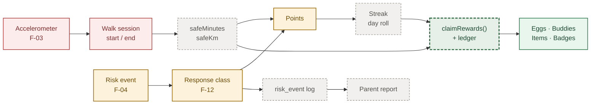
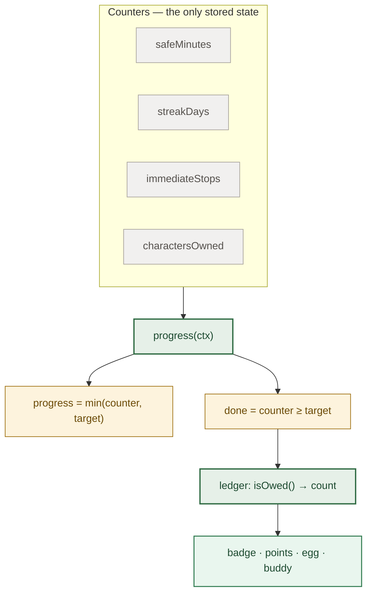

# Progress & Achievements

Engineering brief for the child app · 20 July 2026
Repo at `f646551` · functional spec 2026-06-18

---

## The one thing to know

**The reward engine is already built and correct. It has never been called.**

`claimRewards()` handles rule matching, repeatable back-pay, and de-duplication across three ledgers. It is idempotent — safe to call twice. It has zero call sites in the app.

So this sprint is not "design a rewards system." It is "connect the one that exists to inputs that don't yet produce anything."

**What's missing is upstream:** no walk session, no timer, no day boundary, and no evaluator that decides an achievement is finished.

**Honest scoping:** one week cannot make progress work end to end, because the sensor layer is a research problem with its own tuning period reserved in the spec. One week *can* build the evaluator, the counters, and the trigger — so the day the sensor lands, progress starts moving with no rewrite.

---

## 1 · What is real today

### The pipeline



Green = works · Yellow = partly wired · Grey dashed = hardcoded literal · Red = does not exist · Green dashed = built but never called

The green dashed box is the crux. The two grey boxes on the right are why the child's numbers and the parent's numbers can disagree — they are separate hardcoded tables, not two views of one event stream.

### Screen by screen

| Surface | Status | What is actually happening |
| --- | --- | --- |
| Daily tasks | Pays nothing | Ticking a task builds new objects, so the source array never changes and the tick is lost on remount. The `+100` on the pill never reaches the player's points. Clearing all three fires confetti and nothing else. |
| Weekly tasks | Not rendered | Exported and documented; shown on no screen. |
| Points | Two sources only | Rises only from winning a Battle and the Rewards daily claim. Falls from shop purchases and the point-to-XP exchange. Nothing about walking or safety credits points. |
| Streak | Frozen | Nothing anywhere increments, resets, or evaluates it. There is no date field on the player at all. The 7-dot calendar on Rewards is a *separate* literal — changing the streak will not move the dots. |
| Safe minutes and km | Frozen | Never assigned anywhere. "47 min safe today" on Home is a hardcoded string, not a reading of the field. |
| Achievements | Frozen | All six completion flags are hand-written; no code sets them. "Own 8 characters — 6/8" does not recount, so hatching a buddy does not move it. |
| XP, levels, stages | Works | A real engine: carry-over on level up, cap clamping, stage derived from level. Needs no rework. |
| Grant engine | Works, never called | Matcher, back-pay, three ledgers, idempotent. Zero call sites. |
| Parent report | Frozen | Metrics are literals, unrelated to anything on the child side. |

---

## 2 · How to calculate progress

### The principle: derive it, never store it

JoanX already made this call once. A buddy's evolution stage is not a stored field — it is computed from level on every read. The spec states it as a rule, because a stored stage can contradict the level it came from.

**Achievement progress fails the same way.** A stored "6 of 8 characters" is wrong the moment a buddy hatches — which is the bug in the prototype right now.

So an achievement should declare **what it watches**, not how far along it is:

```javascript
// The whole definition — no progress field, no done field.
{ id: 'a5', tier: 'epic', name: 'Collector',
  when: { metric: 'charactersOwned', reach: 8 },
  reward: 200 }

// Both derived on read. Nothing to keep in sync.
const progressOf = (a, ctx) => Math.min(ctx[a.when.metric] ?? 0, a.when.reach);
const isDone     = (a, ctx) => (ctx[a.when.metric] ?? 0) >= a.when.reach;
```

That `when` shape is **not new** — it is exactly the vocabulary the grant matcher already speaks for eggs, characters and items.

**The payoff:** an achievement becomes a grant rule whose reward happens to be a badge. It inherits the existing ledger, so it can never pay out twice, and no second system needs building.



### The counters

This is the only genuinely new state. Everything else is computed from it.

| Counter | Resets | Fed by |
| --- | --- | --- |
| `safeMinutes` | never | Walk session end — whole minutes only |
| `safeMinutesToday` | daily | Same, plus the day roll |
| `safeKm` | never | Walk session end |
| `streakDays` | on a missed day | Day roll: accident-free increments, otherwise back to 0 |
| `immediateStops` | never | A risk event closed as an immediate stop |
| `charactersOwned` | never | Derived — recount, never store |
| `lastActiveDay` | — | The day boundary itself. Does not exist today, and nothing can roll without it. |

### The point values

Already specified, already sitting in the constants table, with nothing awarding them. These need wiring, not redesign.

| Rule | Value | Status |
| --- | --- | --- |
| Each completed minute of safe walking | 10 pt | No consumer |
| Session under 60 seconds | 0 pt | No consumer — the only anti-abuse rule in the spec |
| Immediate stop bonus | +20 pt | No consumer — the overlay logs the stop and pays nothing |
| Accident-free day | +100 pt | Claim button only, and re-claimable — see G-3 |
| 7 days in a row | +300 pt | No consumer |
| 30 days in a row | Epic egg | Rule exists but unreachable, streak is frozen |

Partial minutes must not accrue. The spec is explicit that a session ending before one minute pays nothing, and it is the only documented defence against earning points by walking three steps.

---

## 3 · Decisions needed before coding

None of these are specified. Whatever the devs write becomes the product decision by default.

### D1 · What governs a "day"?

Streaks, the daily bonus and daily tasks all depend on a day boundary. The only statement in the entire spec is that the battle allowance resets at *local midnight*.

Device-local midnight is client-trusted, while the docs separately require every point mutation to be server-side. A child who changes their device clock can farm the +100 daily and the +300 streak indefinitely. **This shapes the schema, not just the logic — decide it first.**

### D2 · What is a daily task?

There is **no requirement text for missions or tasks anywhere in the spec** — no feature number, no checklist row. Count, content, reward, reset time and rollover are all invented by the prototype.

The grant engine already has daily and weekly rules waiting on "the set was cleared." Until someone defines what a set is, they can never fire.

### D3 · Is there a daily point ceiling?

No cap is documented anywhere — no daily maximum, no session limit, no bound on stop bonuses.

At 10 pt per minute with no ceiling, a child who leaves the phone in a pocket on a long walk out-earns every designed reward path, and an Epic egg costs nothing to reach.

### D4 · Which response counts as "immediate"?

The spec's own bands overlap: a stop "within 10 seconds" is immediate, and "5 to 10 seconds" is delayed. A stop at 7 seconds satisfies both.

This band gates the +20 bonus and the parent's acceptance-rate metric. Two developers will read it two different ways.

### D5 · What replaces "Zone Dodger"?

That achievement requires avoiding danger zones, which depends on the location features — **excluded from this revision**. It is permanently unachievable as written, and it gates an egg grant.

---

## 4 · Gap register

| ID | Gap | Severity | Consequence |
| --- | --- | --- | --- |
| G-1 | No persistence | Blocker | No local storage, no backend. A reload resets every point, level, streak and battle. Nothing else matters until state survives a refresh. |
| G-2 | No walk session | Blocker | No sensor, timer, or session object. Safe minutes cannot be earned, so the points policy has no input at all. Research, not a ticket. |
| G-3 | Daily claim is re-claimable | Bug | Guarded by component state only. Navigate away and back to claim +100 again, without limit. Fixable today. |
| G-4 | No day boundary | Blocker | No date field on the player. Streaks cannot roll, daily counters cannot reset, an accident-free day cannot be evaluated. See D1. |
| G-5 | No achievement evaluator | This sprint | Nothing sets completion. Progress values are decorative and contradict live state. |
| G-6 | `claimRewards()` never called | This sprint | The reward faucet is dead code. Task, streak, distance and achievement grants can never fire. |
| G-7 | Tasks pay nothing | This sprint | Completion is component-local and non-persistent; rewards are shown but never credited. |
| G-8 | Risk events pay nothing | This sprint | The warning overlay runs a real state machine and logs outcomes into an array nobody reads. The stop bonus exists and is never awarded. |
| G-9 | Two conflicting API maps | Decide | The two doc files disagree on endpoints, and one invents a second currency the spec never authorises. Settle before backend work. |
| G-10 | XP curve conflict | Decide | The spec gives a linear formula; the implementation docs use a deliberately bending table and argue against the formula. |
| G-11 | Point values not server-configurable | Decide | The spec requires tuning without an app update; the settings payload does not carry them. |
| G-12 | Child and parent numbers are independent | Architecture | Both are separately hardcoded. The data model already says one event stream must feed rewards *and* the report, or they drift. |
| G-13 | Client-side economy | Pre-launch | Already flagged in the docs as "fatal in production." Hatch rolls, battle outcomes and point mutations must move server-side. Not this week — but don't deepen client authority meanwhile. |

---

## 5 · Build order

Sequenced so each step is verifiable alone, and nothing waits on the sensor.

1. **Fix the re-claimable daily bonus.** An afternoon. A live economy break needing no new architecture.

2. **Add the day boundary and persistence.** A `lastActiveDay` plus a real store. Answer **D1 first** — this step encodes the timezone decision, and changing it later means migrating everyone's streak.

3. **Introduce counters as the only stored progress.** Delete the stored progress and completion fields from achievements in the same commit, so there is never a window where both exist and disagree.

4. **Rewrite achievements as `when` rules.** Reuse the grant matcher's vocabulary. This is the step that answers "how do we calculate progress," and it is testable with no sensor and no UI.

5. **Call `claimRewards()` at the real moments.** Session end, day roll, task set cleared, achievement completed. It is idempotent, so calling it too often is safe. Calling it never — today's behaviour — is the only failure mode.

6. **Wire tasks and risk events to the counters.** Make task completion persist and credit; award the stop bonus when the overlay closes as an immediate stop. Both engines exist; neither is connected.

7. **Feed the parent report from the same stream.** Even with mock events, derive both sides from one source now. Retro-fitting shared truth after two hardcoded tables ship is materially harder.

**Deliberately not this week:** the accelerometer pipeline (G-2) and the server-authoritative economy (G-13). The first has a tuning period reserved in the spec and a 90% accuracy target; the second is a backend project. Steps 1 to 7 are exactly what makes both drop in cleanly when they arrive.
