<div align="center">

# JoanX
### Product & Engineering Documentation

**A child-safety game and guardian dashboard — reverse-engineered from source**

| | |
|---|---|
| **Document version** | 1.0 |
| **Covers repository at** | branch `main`, `package.json` v1.0.0 |
| **Status** | Complete for the current prototype; §9–§11 describe a *proposed* backend that does not yet exist |
| **Method** | Every value, formula, field name and path below was read out of the source, the client's functional spec, and the git history. Nothing is inferred without being labelled as such. |
| **When the source cannot answer** | The document says **"Not identifiable from the available source."** |

</div>

---

## ⚠️ Read this before anything else

**JoanX is a spec-complete front-end prototype.** Four facts, up front, so nobody discovers them on
day two:

| | Fact | Evidence |
|---|---|---|
| ✅ | **All 38 in-scope requirements** of the 2026-06-18 functional spec are designed and built, across both apps | [`SPEC-CHECKLIST.md`](SPEC-CHECKLIST.md) · the in-app *Spec checklist* tab |
| ❌ | **No backend. No database. No API.** | Zero `fetch` / `axios` / WebSocket calls exist anywhere in `src/`. `package.json` has exactly **three** runtime dependencies |
| ❌ | **No tests. No CI. No TypeScript. No persistence.** | A page reload resets every point, level and battle |
| ✅ | **But the server seam is written and validated** | Four settings setters that a `GET /settings` response feeds directly, each with per-field fallback |

Every "server" value is a mock object in [`src/core/data.jsx`](src/core/data.jsx), whose first line
reads: *"JoanX — mock data for the prototype (stand-ins for API responses)."*

This is a **product decision, not an omission** — the deliverable was a reviewable prototype, and a
backend would have bought that goal nothing. Sections [9](#9-backend-architecture),
[10](#10-database-documentation) and [11](#11-api-documentation) therefore document **the contract the
code implies**, explicitly labelled *proposed*, not *existing*.

---

## How to read this document

| If you are… | Start at | Then read |
|---|---|---|
| **A recruiter / hiring manager** | [§1 Executive Summary](#1-executive-summary) · [§22 Portfolio Summary](#22-portfolio-summary) | [§19 Product Decisions](#19-product-decisions) · [§21 Interview Guide](#21-interview-guide) |
| **A product manager** | [§2 Product Overview](#2-product-overview) · [§3 Requirements](#3-requirements) | [§4 Features](#4-feature-documentation) · [§12 Business Logic](#12-business-logic) · [§20 Roadmap](#20-future-roadmap) |
| **A product designer / UX researcher** | [§5 User Flows](#5-complete-user-flow) · [§6 Information Architecture](#6-information-architecture) | [§7 UI/UX](#7-ui--ux-documentation) · [Appendix D: Screen reference](#appendix-d--screen-reference) |
| **A frontend engineer** | [§8 Frontend Architecture](#8-frontend-architecture) · [§13 Codebase](#13-codebase-architecture) | [Appendix B: Function reference](#appendix-b--function-reference-coredatajsx) · [Appendix C: Component API](#appendix-c--component-api-reference) |
| **A backend engineer** | [§9 Backend](#9-backend-architecture) · [§10 Database](#10-database-documentation) · [§11 API](#11-api-documentation) | [§12 Business Logic](#12-business-logic) · [Appendix A: Data dictionary](#appendix-a--complete-data-dictionary) |
| **A QA engineer** | [§18 Testing](#18-testing) | [Appendix H: Test matrix](#appendix-h--qa-test-matrix) · [§3.5 Edge cases](#35-edge-cases-handled-deliberately) |
| **Joining the team on Monday** | [Appendix I: Onboarding](#appendix-i--new-engineer-onboarding) | Then read `src/core/data.jsx` end to end. Nothing else comes close in importance |

---

## Table of contents

**Part I — The product**
[1. Executive Summary](#1-executive-summary) ·
[2. Product Overview](#2-product-overview) ·
[3. Requirements](#3-requirements) ·
[4. Feature Documentation](#4-feature-documentation) ·
[5. Complete User Flow](#5-complete-user-flow)

**Part II — The design**
[6. Information Architecture](#6-information-architecture) ·
[7. UI / UX Documentation](#7-ui--ux-documentation)

**Part III — The engineering**
[8. Frontend Architecture](#8-frontend-architecture) ·
[9. Backend Architecture](#9-backend-architecture) ·
[10. Database Documentation](#10-database-documentation) ·
[11. API Documentation](#11-api-documentation) ·
[12. Business Logic](#12-business-logic) ·
[13. Codebase Architecture](#13-codebase-architecture) ·
[14. Tech Stack](#14-tech-stack) ·
[15. DevOps](#15-devops)

**Part IV — The quality bar**
[16. Security](#16-security) ·
[17. Performance](#17-performance) ·
[18. Testing](#18-testing)

**Part V — The thinking**
[19. Product Decisions](#19-product-decisions) ·
[20. Future Roadmap](#20-future-roadmap) ·
[21. Interview Guide](#21-interview-guide) ·
[22. Portfolio Summary](#22-portfolio-summary) ·
[23. Architecture Diagrams](#23-architecture-diagrams) ·
[24. Glossary](#24-glossary) ·
[25. Appendix](#25-appendix)

**Part VI — Reference (the parts you'll actually keep open)**
[A. Data dictionary](#appendix-a--complete-data-dictionary) ·
[B. Function reference](#appendix-b--function-reference-coredatajsx) ·
[C. Component API](#appendix-c--component-api-reference) ·
[D. Screen reference](#appendix-d--screen-reference) ·
[E. Traceability matrix](#appendix-e--traceability-matrix) ·
[F. Architecture Decision Records](#appendix-f--architecture-decision-records-adrs) ·
[G. Risk register](#appendix-g--risk-register) ·
[H. QA test matrix](#appendix-h--qa-test-matrix) ·
[I. New-engineer onboarding](#appendix-i--new-engineer-onboarding) ·
[J. Coding standards](#appendix-j--coding-standards--contribution-guide) ·
[K. Analytics taxonomy](#appendix-k--proposed-analytics--event-taxonomy) ·
[L. Privacy & compliance](#appendix-l--privacy--compliance) ·
[M. Performance budget](#appendix-m--proposed-performance-budget) ·
[N. Release runbook](#appendix-n--release-runbook) ·
[O. File inventory](#appendix-o--file-inventory)

**Companion documents** (this file does not duplicate them):
[`README.md`](README.md) · [`ARCHITECTURE.md`](ARCHITECTURE.md) · [`DOCUMENTATION.md`](DOCUMENTATION.md) ·
[`DESIGN-SYSTEM.md`](DESIGN-SYSTEM.md) · [`SPEC-CHECKLIST.md`](SPEC-CHECKLIST.md) ·
[`JoanX_Functional_Spec_2026-06-18_EN.md`](JoanX_Functional_Spec_2026-06-18_EN.md) — the client's spec,
the source of every `F-xx` / `A-x.x` ID in this document.
**In-app:** `?view=docs` (visual version, with charts) · `?view=checklist` · `?view=design`.

---
---

# Part I — The product

## 1. Executive Summary

### 1.1 What is this product?

**JoanX is a two-sided mobile product that stops children using their phone while walking.**

- The **child app** is a game. Walk with the phone away → earn points and EXP → hatch eggs → grow a
  buddy through three evolution stages → decorate a house → visit friends → and fight ten villains
  who personify the things that actually get children hurt on the road.
- The **parent app** ("Guardian") is a dashboard answering one question: *is the behaviour changing?*
  Warning acceptance, safe-walking minutes, response time, streaks.

The two are joined by a 6-digit pairing code. **The child device holds no account** — the parent holds
the account; the child pairs to it.

### 1.2 The problem

"Smombie" (smartphone-zombie) walking. A child looking down at a screen does not see the car. Every
existing answer is punitive — block the phone, lock the screen, track the child's location — and
children route around them, resent them, or uninstall them.

### 1.3 The thesis

> **A safety app a child deletes is worth nothing. So make looking up the thing that wins the game.**

The phone is never seized. It buzzes; then a gentle card appears; then the child's own buddy speaks.
**Stopping quickly is what pays points**, and points are what grow the character the child is attached
to.

This thesis is not marketing — it is visible as *constraints in the code*:

| The thesis says… | …so the code does this |
|---|---|
| Never punish | The intervention has **no screen block**. The strongest tier is a firmer sentence, not a lock |
| Never spy | The parent-visible model **excludes location, messages, photos** — and the child is *shown* that list |
| Never expose children to each other | The guestbook is **six fixed stamps**, never free text |
| Never make a child pay to win | **Guaranteed unlocks** sit beside the gacha: a 30-day streak hands over an Epic outright |
| Never turn a reward into an obligation | **Evolution grants no stats** — it is art, not power |

### 1.4 Target users

| User | Profile | Primary need | Account |
|---|---|---|---|
| **Child** (primary user) | ~6–13 (seeded personas: 11, 8, 6) | A game they'd *choose* to play — not to be policed | **None.** Pairs with a 6-digit code |
| **Parent / guardian** (buyer) | Adult account holder | Evidence their child is safer, without spying | Phone + SMS; Google (Android) / Apple (iOS) |
| **Joan Company** | Client, IP owner | An approvable spec and an original character line | Approves villain names, stories, art |

### 1.5 Business value

1. **Parents buy an outcome, not surveillance.** The dashboard leads with a *risk-reduction rate*.
2. **Retention is designed into the loop.** Hitting the level cap is not an ending — you hatch a new
   egg and grow a different buddy. Spec A-3.2 calls this *the core loop*.
3. **The villains are an IP asset** — ten original characters built to extend into seasonal waves.
4. **Every economy value is server-tunable**, so the business rebalances without an app release.

### 1.6 Product goals & how they are measured

| Goal | Measured by | Seeded baseline |
|---|---|---|
| A child looks up **quickly** | `avgResponse` | 2.4 s |
| A child looks up **repeatedly** | `acceptance` (warnings ending in a stop) | 88% |
| A child looks up **voluntarily** (behaviour actually changes) | `riskReduction`, `phoneUseDrop` | 41%, 0.42 |
| The parent has **proof** | The 7-day reaction chart + AI narrative | — |
| The child **keeps playing** | `streak` | 5 days |

---

## 2. Product Overview

### 2.1 The core loop

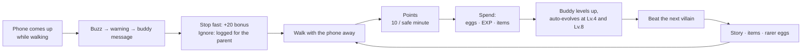

### 2.2 The economics of the loop — the single most useful number in this document

| Step | Value | Source |
|---|--:|---|
| EXP from Lv.1 to the Lv.10 cap | **2,250 EXP** | Sum of `XP_CURVE.steps` |
| Bought purely with points at 5:1 | **11,250 points** | `EXCHANGE.pointsPerXp = 5` |
| At 10 points per phone-free minute | **1,125 minutes** | `POINTS.perSafeMinute = 10` |
| | **≈ 19 hours of safe walking** | |

That is the pace of the **entire game** — and it is **one server setting** away from being changed
(`setXpCurve`, `setExchange`, or `POINTS`). If the pilot shows children losing interest at week two,
this is the number you move, and you move it without shipping an app.

### 2.3 User journey — the child's first week

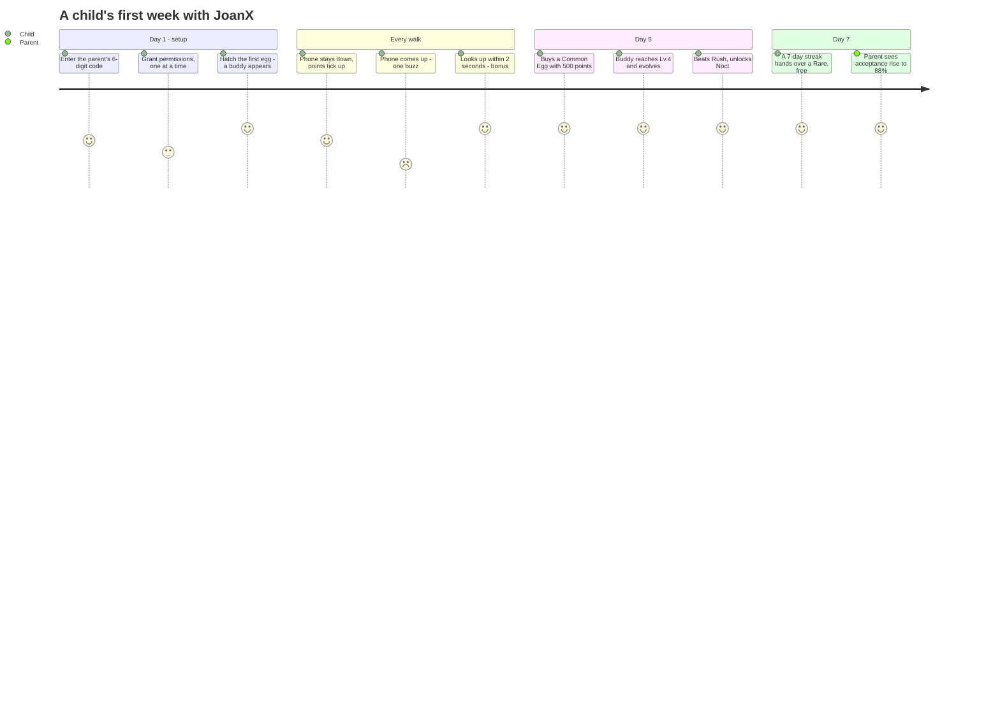

### 2.4 Main workflows → screens → spec

| # | Workflow | Screens | Spec IDs |
|---|---|---|---|
| 1 | Child onboarding & pairing | `Onboarding.jsx` | F-26, F-33 |
| 2 | Risk intervention | `WarningOverlay.jsx` | F-04, F-07, F-08.1–8.4, F-09, F-12 |
| 3 | Earn & spend | `Rewards.jsx`, `Shop.jsx` | F-13, F-14, A-1.1, A-1.2, A-2 |
| 4 | Grow & evolve | `CharacterVariants.jsx`, `CharacterDex.jsx` | F-16, A-3.1–3.3 |
| 5 | Battle & story | `Battle.jsx`, `VillainDex.jsx` | F-19, A-8, A-8.1, A-9 |
| 6 | Social | `Friends.jsx`, `FriendHouse.jsx`, `Guestbook.jsx`, `MyHouse.jsx`, `DecorateRoom.jsx` | F-32, A-6, A-7, A-10 |
| 7 | Parent reporting | `ParentReports.jsx`, `ParentAIReport.jsx`, `ParentActivity.jsx` | F-20, F-31 |
| 8 | Parent control | `ParentSettings.jsx`, `ParentChildren.jsx` | F-22 |

### 2.5 Business model

**Partially determined from the source.** `HowItWorks.jsx` renders a `PLANS` array and
`TRIAL_DAYS = 7`; `ParentDetail.jsx` has a *plan* sub-page. So the modelled direction is a **freemium
subscription with a 7-day trial, sold to the parent.**

**Pricing, payment provider and billing logic: not identifiable from the available source.** No
payment SDK, no price constants, no receipt validation exists in the repository.

### 2.6 Roles & permission matrix

Two **device** roles. **No admin role exists anywhere** — operational control is *data*
(`enabled` flags + server settings), never a screen.

| Capability | Child | Parent | Notes |
|---|:--:|:--:|---|
| Play the game, spend points, battle | ✅ | — | |
| Visit friends' houses, leave a like / stamp | ✅ | — | Six fixed stamps; **no free text** |
| See "what my parent can see" | ✅ | — | `Profile.jsx` renders `PARENT_SEES` |
| See walk duration, warnings, points, streak | — | ✅ | |
| See which **app types** are blocked | — | ✅ | Types, not individual apps |
| See **location** | — | ❌ | The whole GPS family is feature-flagged off |
| See **messages / guestbook / photos** | — | ❌ | By design |
| Change intervention sensitivity | — | ✅ | `ParentSettings.jsx` (F-22) |
| Block app categories | — | ✅ | 6 categories; *Phone & Texts* is `locked: true` — never blockable |
| Turn the game off entirely | — | ✅ | |
| **Unlink the device** | ❌ | ✅ | **Parent-only, deliberately** |

> *"Unlinking is deliberately parent-only: a child who could quietly disconnect would make the product
> a promise the parent cannot rely on."* — `data.jsx`

### 2.7 Success metrics

| Metric | Seed | Definition | Where |
|---|--:|---|---|
| `riskReduction` | 41% | Fewer risky moments than this child's own baseline | `PARENT_METRICS` |
| `acceptance` | 88% | Warnings that ended in a stop | `CHILD_REPORTS.k1` |
| `safeWalkMin` | 312 | Phone-free walking minutes | `CHILD_REPORTS.k1` |
| `avgResponse` | 2.4 s | How fast the child looks up | `CHILD_REPORTS.k1` |
| `streak` | 5 | Consecutive accident-free days | `PLAYER.streak` |
| `phoneUseDrop` | 0.42 | Phone use vs. **the child's own first week** | `PLAYER.phoneUseDrop` |

**Why `phoneUseDrop` is self-referential:** measuring a child against *other children* would punish
whoever started out worst. Measuring them against their own first week rewards improvement. This is a
product decision encoded as a data model.

---

## 3. Requirements

### 3.1 Functional requirements → implementation → status

| ID | Requirement | Implemented in | Status |
|---|---|---|:--:|
| F-01 | Operating mode (Lite) | `LiteBlock.jsx` | 🚫 Excluded (built, parked) |
| F-02 | Operating mode (Smart) — motion only, no GPS | The whole child app | ✅ |
| F-03 | Walk detection (1.2–2.5 Hz, 8 s sustain) | `SafetyStatus.jsx` (UI); engine out of scope | ✅ |
| F-04 | Risk event = walking + phone use ≥ 10 s | `WarningOverlay.jsx` | ✅ |
| F-05 | Danger-zone algorithm | — | 🚫 Excluded (`FEATURES.dangerZones = false`) |
| F-06 | GNSS correction | — | 🚫 Excluded |
| F-07 | Grace-period handling (10 s) | `INTERVENTION.graceSeconds` | ✅ |
| F-08 | Staged intervention UX | `WarningOverlay.jsx` | ✅ |
| F-08.1 | Warning only if risk persists 2 s past the buzz | `INTERVENTION.buzzHoldSeconds` | ✅ |
| F-08.2 | Dismiss → 5 s cooldown → re-intervene | `INTERVENTION.recheckSeconds` | ✅ |
| F-08.3 | Progressive tone + event logging | `INTERVENTION.tiers`, `logRiskEvent()` | ✅ |
| F-08.4 | Safe-state confirmation (anti-flicker) | `INTERVENTION.safeConfirmSeconds` | ✅ |
| F-09 | Character message (1.5 s toast) | `CharMessageToast` | ✅ |
| F-09.1 | Message rotation (anti-fatigue) | `INTERVENTION.messages` | ✅ |
| F-09.2 | Configurable message timing | `messageSeconds`, `messageGapSeconds` | ✅ |
| F-10 | Full-screen block (Lite) | `LiteBlock.jsx` | 🚫 Excluded |
| F-11 | Overlay warning (sheet / spotlight / banner) | `WarningOverlay.jsx` | ✅ |
| F-12 | User-response classification | `logRiskEvent()` → parent report | ✅ |
| F-13 | Points · XP growth | `POINTS` | ✅ |
| F-14 | Daily accident-free reward | `Rewards.jsx` | ✅ |
| F-15 | Character acquisition · rarity | `EGGS`, `hatchEgg()` | ✅ |
| F-15.1 | MVP roster 15 (8 / 5 / 2), extensible | `CHARACTERS` | ✅ |
| F-15.2 | Epics hidden until unlocked | `visibleCharacters()` | ✅ |
| F-16 | Character evolution (3 stages) | `STAGES`, `stageForLevel()` | ✅ |
| F-17 | Character customization | `Shop.jsx`, `CharacterDetail.jsx` | ✅ |
| F-18 | Collection House (≥ 3 rooms) | `MyHouse.jsx` | ✅ (4 rooms) |
| F-19 | Battle system (PvE) | `Battle.jsx` | ✅ |
| F-20 | Guardian report metrics | `ParentReports.jsx` | ✅ |
| F-21 | Time-based policy settings | `ParentSchedule.jsx` | 🚫 Excluded (built ahead) |
| F-22 | Intervention-intensity settings | `ParentSettings.jsx` | ✅ |
| F-23 | Local event storage | — | ⚙️ Engine |
| F-24 | Event transmission API (`POST /event`) | `logRiskEvent()` (client half) | ⚙️ Backend |
| F-25 | Dynamic risk score | — | ⚙️ Engine |
| F-26 | Staged permissions & fallback | `Onboarding.jsx` | ✅ |
| F-27–F-29 | Android-first · background · logging | — | ⚙️ Platform |
| F-30 | Walk-detection tuning period | — | ⚙️ Process (no UI to design) |
| F-31 | AI parent report | `ParentAIReport.jsx` | ✅ |
| F-32 | Friend visit · likes · guestbook (no chat) | `Friends.jsx`, `FriendHouse.jsx` | ✅ |
| F-33 | Guardian sign-in (phone + SMS) | `auth.jsx` | ✅ |
| F-33.1 | Google (Android) / Apple (iOS); email excluded | `AUTH.methods` | ✅ |
| A-1.2 | Point → EXP conversion | `EXCHANGE`, `convertPointsToXp()` | ✅ |
| A-2 / A-2.1 / A-2.2 | Eggs · prices · hatch | `EGGS`, `hatchEgg()` | ✅ |
| A-3.1 / A-3.2 / A-3.3 | EXP curve · Lv.10 cap · stats | `XP_CURVE`, `STAT_GROWTH` | ✅ |
| A-4 / A-4.1 | Encyclopedia · behaviour unlocks | `CharacterDex.jsx`, `CHARACTER_UNLOCKS` | ✅ |
| A-5 / A-5.1 | Items — one unified model | `ITEMS`, `ITEM_GRANTS` | ✅ |
| A-6 / A-7 | House · room decoration | `MyHouse.jsx`, `DecorateRoom.jsx` | ✅ |
| A-8 / A-8.1 | 10 villains · 5/day · repeat challenges | `VILLAINS` | ✅ |
| A-9 | Villain encyclopedia | `VillainDex.jsx` | ✅ |
| A-10 / A-10.1 | Friend visits · guestbook stamps | `FriendHouse.jsx`, `GUEST_STAMPS` | ✅ |

**Coverage: 38 built · 5 excluded by the revision · 1 process-only = 44 audited requirements.**

### 3.2 Non-functional requirements

| # | Area | Requirement | Current state |
|---|---|---|---|
| NFR-1 | **Performance** | *Not specified by the client* | No budget set. One bundle; Vite warns > 500 kB. A proposed budget is in [Appendix M](#appendix-m--proposed-performance-budget) |
| NFR-2 | **Accessibility** | *Not specified* | **Partial** — honest audit in [§7.7](#77-accessibility--honest-audit) |
| NFR-3 | **Localization** | Korean + English | ✅ 1,201 keys · boots in Korean |
| NFR-4 | **Responsive** | Phone-first | The apps render in a fixed 390×844 frame; the *frame* scales. Doc pages are genuinely responsive |
| NFR-5 | **Offline** | Protection must survive disconnection | ⚠️ **Simulated only** — an "Offline" demo state exists; no service worker, no cache |
| NFR-6 | **Security** | Child data must be minimal | Design-level: ✅ (data minimisation). Implementation-level: N/A — no auth, no network |
| NFR-7 | **Platform** | Android-first (F-27) | The platform sniffer supports `ios` / `android` / `web` |
| NFR-8 | **Browser support** | — | **Not identifiable from the available source** (no browserslist, no polyfills) |

### 3.3 Business rules — the constraints that actually shape the code

| # | Rule | Rationale | Enforced by |
|---|---|---|---|
| BR-1 | **A stage grants no stats** | Evolving must be a reward, never an obligation. Stated *twice* in `data.jsx` so nobody adds a stage multiplier later | `STAT_GROWTH` has no stage term; `setStatGrowth` **ignores** a `stageMult` in the payload |
| BR-2 | **Repeat battle rewards < first-clear rewards** | Re-fighting is for records and practice, not farming | `BATTLE_REWARDS.repeat` (40/20) < `.firstClear` (120/60) |
| BR-3 | **Every decoration is purchasable with points** | A `null` price would mean "unobtainable by saving", which A-5.1 forbids | No `DECOR` / `HOUSE_BGS` row has `price: null` |
| BR-4 | **Only an Epic Egg can hatch an Epic** | The entire mechanism keeping the 2 hidden characters rare | `EGGS.common.odds.epic = 0`, `EGGS.rare.odds.epic = 0` |
| BR-5 | **Sequential villain unlock** | The ladder *is* the story | `villainUnlocked(v)` |
| BR-6 | **The final boss is a role, not a row position** | An appended seasonal villain must not steal the ending | `finalVillain()` matches `role === 'finalBoss'` |
| BR-7 | **Hidden Epics are invisible everywhere** | No slot, no silhouette, not in the completion denominator | `isRevealed()`, `visibleCharacters()` |
| BR-8 | **A grant never pays twice** | Idempotency | Three ledgers + `isOwed()` returning a *count* |
| BR-9 | **Points leave the wallet only if the EXP lands** | No dead spend | `convertPointsToXp()` computes the verdict *before* debiting |
| BR-10 | **A purchase can never overshoot the level cap** | No dead spend | `xpToCap()` in `canConvertPoints()` |
| BR-11 | **The guestbook is stamps only** | A free text box between two children is an unmoderated message channel | `GUEST_STAMPS` — six rows, no input field exists |
| BR-12 | **Max 5 battles/day**, consumed on resolve (win *or* lose) | Keeps the fun a reward for walking | `BATTLES_PER_DAY`, `PLAYER.battlesToday` |
| BR-13 | **Duplicates convert to EXP** (30 / 60 / 120) | A duplicate pull is never a dead pull | `RARITIES[].dupXp` |
| BR-14 | **A session under 60 s pays nothing** | Anti-gaming: no pocketing points by walking three steps | `POINTS.minSessionSeconds` |
| BR-15 | **Phone & Texts can never be blocked** | A child must always be able to call for help | `APP_CATEGORIES` → `phone: { blocked: false, locked: true }` |
| BR-16 | **Never a screen block** | The whole thesis (see [§1.3](#13-the-thesis)) | The strongest tone tier is a firmer sentence, not a lock |

### 3.4 Validation rules

| Input | Rule | Failure behaviour | Where |
|---|---|---|---|
| Phone number | ≥ 10 digits after stripping non-digits | CTA disabled | `auth.jsx` |
| SMS code | 6 boxes; **any complete code passes** (prototype) | `codeErr` → `jx-shake` | `auth.jsx` |
| Resend SMS | Locked 180 s | Countdown shown | `AUTH.smsResendSeconds` |
| Pairing code | 6 digits · 300 s expiry | Inline error + retry | `Onboarding.jsx` |
| Buy an item | `canBuyItem()` | Verdict: `owned` · `not-for-sale` · `level` · `stage` · `points` → toast | `data.jsx` |
| Point → EXP | `canConvertPoints()` | Verdict: `no-buddy` · `maxed` · `min` · `cap` · `points` | `data.jsx` |
| Server settings | Per-field type + range check | **Silent fallback to the launch default** | 4 setters |

### 3.5 Edge cases handled deliberately

| # | Edge case | Handling | Why it matters |
|---|---|---|---|
| EC-1 | Sensor flutter | `safeConfirmSeconds = 1` — one safe reading does not tear the overlay down | Otherwise the overlay strobes |
| EC-2 | Level cap reached | `xpForLevel()` returns `null`; the bar is pinned full | Otherwise: divide by null |
| EC-3 | EXP overflow | `gainXp()` **carries** the remainder into the next level | 500 XP into a 100-XP level should level you *four* times, not once |
| EC-4 | EXP hitting the cap | Returned as `lost` in the result | So the UI can tell the child instead of silently eating it |
| EC-5 | Malformed remote settings | Per-field fallback; `pointsPerXp: 0` rejected | *"Would divide by zero and hand out infinite levels"* |
| EC-6 | Duplicate hatch | Converts to EXP by rarity | A duplicate is never a dead pull |
| EC-7 | Rarity tier exhausted | `unlockTarget()` returns `null` | Never hand over a duplicate as an "unlock" |
| EC-8 | Bought-then-earned item | `itemsEarned()` skips owned items | A child who *bought* the trophy isn't "granted" it on their 10th win |
| EC-9 | Repeatable grant resumed mid-way | `isOwed()` returns a **count** | 80 km walked pays all three 25-km eggs at once |
| EC-10 | Seasonal villain appended after the boss | `finalVillain()` asks the **role** | The ending stays with Nox |
| EC-11 | Seed character above the cap | `applyXpCurve()` clamps on load | Illegal state cannot exist at boot |
| EC-12 | A stage tweak that would create an illegal buddy | The Tweaks panel sets the **level**, not the stage | A Stage-3 Lv.5 buddy would have art and stats that disagree |
| EC-13 | Ladder fully cleared | `nextVillain()` returns `null`; the aim stays on Nox, still re-challengeable | No crash, and the finale stays replayable |

### 3.6 Constraints

- **Motion only, no GPS** in the in-scope build.
- **No chat anywhere** — a hard child-safety constraint.
- **Android-first** (F-27).
- **Villain names, stories and art are subject to Joan Company approval.** `VILLAINS[].look` carries
  the art direction; `species` / `color` are explicitly the prototype's placeholder renderer.
- **The client's functional spec is the contract.** Every rule cites its ID.

---

## 4. Feature Documentation

Each feature is documented against the same template: *Purpose · User problem · Business goal ·
Workflow · UI · Logic · Validation · Permissions · API · Database · Edge cases · Future · Example.*

---

### 4.1 Staged Intervention — the safety core

| Field | Value |
|---|---|
| **Purpose** | Get the child's eyes up without seizing the phone |
| **User problem** | A child walking head-down does not perceive traffic |
| **Business goal** | The metric the parent pays for: acceptance rate + response time |
| **Spec** | F-04 · F-07 · F-08 · F-08.1–8.4 · F-09 · F-09.1 · F-09.2 · F-11 · F-12 |
| **Screens** | `src/child/WarningOverlay.jsx` (545 lines) · `LiteBlock.jsx` (parked) |
| **Permissions** | Child device. The parent tunes sensitivity via `ParentSettings.jsx` |
| **API** | **None — prototype.** In production this is the client of **F-24 `POST /event`** |
| **Database** | **None.** `RISK_EVENT_LOG` is an in-memory array |

#### Workflow

```mermaid
stateDiagram-v2
    [*] --> grace: risk detected<br/>(walking + phone use ≥ 10s)
    grace --> buzz: 10s elapsed, still risky
    grace --> reward: looked up (self-correct)
    buzz --> warn: risk persists 2s (the buzz hold)
    buzz --> reward: stopped inside the hold window
    warn --> message: ignored 5s
    warn --> reward: "I looked up"
    message --> cooldown: dismissed / ignored
    cooldown --> buzz: 5s → re-assess, tone firms up
    message --> reward: stopped
    reward --> [*]: logRiskEvent(immediate | delayed | ignored)
```

#### Logic — every timing is a server setting

| Constant | Value | Meaning | Spec |
|---|--:|---|---|
| `graceSeconds` | 10 | Self-correct window before anything fires | F-07 |
| `buzzHoldSeconds` | 2 | Risk must persist this long *after* the buzz for a warning to appear | F-08.1 |
| `recheckSeconds` | 5 | Silent cooldown after a dismiss/ignore, then re-assess | F-08.2 |
| `safeConfirmSeconds` | 1 | Safe state must hold this long before the overlay is removed | F-08.4 |
| `maxRounds` | 3 | Tone-ladder length; further rounds repeat the strongest tier | F-08.3 |
| `messageSeconds` | 1.5 | Buddy-message toast duration | F-09 |
| `messageGapSeconds` | 3 | Minimum gap between messages | F-09.2 |

#### The tone ladder (F-08.3) — verbatim from `INTERVENTION.tiers`

| Round | Tier | Title | Body |
|--:|---|---|---|
| 1 | `gentle` | *"Eyes up,"* | "Let's put the phone away while we're walking." |
| 2 | `firm` | *"Still walking,"* | "Phone down until you stop — I mean it this time." |
| 3+ | `urgent` | *"This is unsafe,"* | "Stop walking or put the phone away now. This is going in your report." |

**Note what the strongest tier is: a sentence.** Never a lock. That is the thesis, enforced in copy.

#### Message rotation (F-09.1) — `INTERVENTION.messages`

| Tier | Pool |
|---|---|
| `gentle` | "Eyes up!" · "Phone away for now" · "Look ahead!" · "Watch your step!" |
| `firm` | "Still on your phone?" · "Eyes on the path, please" · "Phone down while walking" · "Head up — I mean it" |
| `urgent` | "Stop walking — now" · "This is unsafe" · "Put the phone away" · "Look up before you get hurt" |

The code's own comment on why: *"the same line twice running breeds fatigue and then resistance."*
Each round starts at a different offset, and no line repeats back-to-back.

#### Validation & edge cases
- The warning **never** appears if the child stops inside the 2-second buzz hold — it is counted as a
  self-correction and skips straight to the reward.
- **The buzz stage has no button.** In the real product there is nothing to press: the phone vibrates
  and detection notices you stopped. The layer itself stands in for that signal so the demo can still
  reach the save.
- `safeConfirmSeconds` exists because accelerometer and usage signals flutter — a single stray reading
  would flicker the overlay off and straight back on (EC-1).

#### Output — the one number that travels
```js
logRiskEvent({ outcome: 'immediate' | 'delayed' | 'ignored', rounds, tier })
```
Those three words are what the reward system reads *and* what the parent report is built from. **One
number, from the sensor to the parent, with no re-interpretation in between.**

#### Future improvements
Wire to the real motion/usage engine · make the tone ladder a remote setting (the copy is already
data, not markup) · **add `aria-live` so a screen reader announces the warning** (see
[Appendix G, RISK-3](#appendix-g--risk-register)).

#### Example scenario
> Mina is crossing a junction while replying to a message. Ten seconds in, her phone buzzes once. She
> keeps walking; two seconds later a gentle card appears: *"Eyes up, — Let's put the phone away while
> we're walking."* She taps **I looked up** within 2 seconds. The event is logged as `immediate`, she
> earns **+20 points**, and her parent's acceptance rate ticks up. If she had ignored it, the buddy
> would have spoken; if she had ignored *that*, round two would have opened with *"Still walking,"* —
> and the report would have recorded `ignored`.

---

### 4.2 Points, EXP & the Economy

| Field | Value |
|---|---|
| **Purpose** | Convert safe behaviour into the only currency in the game |
| **User problem** | "Why should I bother?" |
| **Business goal** | Make the safe choice the rewarding choice |
| **Spec** | F-13 · F-14 · A-1.1 · A-1.2 |
| **Screens** | `Rewards.jsx` · `Shop.jsx` · every home layout |

#### Earning (`POINTS`)

| Rule | Value | Spec |
|---|--:|---|
| Per phone-free walking minute | **10 pt** | F-13 |
| Minimum session to pay anything | 60 s | A-1.1 |
| Immediate-stop bonus (after a warning) | **+20 pt** | F-13 |
| Daily accident-free bonus | **+100 pt** | F-14 |
| 7-day accident-free streak | **+300 pt** | F-14 |
| 30-day streak | **An Epic Egg** | F-14 |

#### Spending (`EXCHANGE`)

```js
EXCHANGE = { pointsPerXp: 5, stepXp: 10 }   // 5 pt = 1 EXP; minimum purchase 10 EXP (= 50 pt)
```

#### Validation
`canConvertPoints()` returns verdicts in strict order:
`no-buddy` → `maxed` → `min` → `cap` → `points` → `ok`.
It **refuses to overshoot the level cap** (`xpToCap`), so no point is ever spent on EXP with nowhere
to land. Points are debited **only** on `ok` (BR-9).

#### Edge case
A server sending `pointsPerXp: 0` is rejected outright — *"it would divide by zero and hand out
infinite levels."*

#### Example scenario
> Mina has 1,240 points. She opens *Grow your buddy*, picks Hammy (Lv.7, 320/330 XP), and dials 60 EXP
> — 300 points. `canConvertPoints` checks: she has a buddy ✅, not maxed ✅, above the 10-EXP minimum ✅,
> 60 EXP fits under the cap ✅, she can afford 300 pt ✅. The points are debited, `gainXp` fills the
> remaining 10 XP of Lv.7, **levels her to Lv.8, carries the remaining 50 XP into Lv.8**, and — because
> Lv.8 is the Stage-3 threshold — Hammy evolves into a Guardian on the spot.

---

### 4.3 Character Growth & Evolution

| Field | Value |
|---|---|
| **Purpose** | Give the child something they're attached to, that visibly grows |
| **Spec** | F-16 · A-3.1 · A-3.2 · A-3.3 |
| **Screens** | `CharacterVariants.jsx` (581 lines) · `CharacterDetail.jsx` · `CharacterDex.jsx` |

#### The EXP curve (A-3.1)

| Progression | EXP | Δ | | Progression | EXP | Δ |
|---|--:|--:|---|---|--:|--:|
| Lv.1 → 2 | 100 | — | | Lv.6 → 7 | 270 | +50 |
| Lv.2 → 3 | 120 | +20 | | Lv.7 → 8 | 330 | +60 |
| Lv.3 → 4 | 150 | +30 | | Lv.8 → 9 | 400 | +70 |
| Lv.4 → 5 | 180 | +30 | | Lv.9 → 10 | 480 | +80 |
| Lv.5 → 6 | 220 | +40 | | **Total** | **2,250** | cap = Lv.10 |

**Why a table and not a formula.** The step grows from **+20 to +80** — the curve *bends*. A linear
rule (`base + (n−1) × step`) can only draw a straight line, and the previous implementation was
exactly that. `growth: 1.2` and `roundTo: 10` extend the curve *past* the table, so raising `maxLevel`
in a future update still yields a sane ladder if the table isn't extended at the same time.

#### Stages (A-3.3)

| Stage | Levels | Name | Animation | Expression | Grants |
|--:|---|---|---|---|---|
| 1 | Lv.1–3 | Hatchling | `jx-float` | curious | Art only |
| 2 | Lv.4–7 | Growing | `jx-bounce` | happy | Art only |
| 3 | Lv.8–10 | Guardian | `jx-pulse-soft` | proud | Art only |

- **Evolution is automatic** — it fires on the level-up that earns it, *wherever* that happens (a
  battle, a mission, the point exchange). A manual button would let a Lv.8 buddy sit un-evolved
  because the child never opened the screen.
- **A stage grants no stats** (BR-1). Stated twice in `data.jsx`.

#### Stats — derived on read, never stored

```
affinity(t) = 0.8 + t/250                                      // trait 50 → 1.0, trait 90 → 1.16
stat        = round((base[rarity] + perLevel[rarity] × (level − 1)) × affinity)
power       = courage + protection + speed + hp/5              // HP scaled so it doesn't drown the rest
```

| Rarity | base (HP · Cou · Pro · Spd) | perLevel (HP · Cou · Pro · Spd) |
|---|---|---|
| Common | 100 · 40 · 40 · 40 | 12 · 4 · 4 · 4 |
| Rare | 120 · 50 · 48 · 46 | 16 · 5.5 · 5 · 5 |
| Epic | 150 · 62 · 58 · 55 | 22 · 7 · 6.5 · 6 |

**There is deliberately no stage term in this table** — and `setStatGrowth()` *ignores* a `stageMult`
key if a server ever sends one.

---

### 4.4 Eggs, Rarity & Acquisition

| Field | Value |
|---|---|
| **Spec** | F-15 · F-15.1 · F-15.2 · A-2 · A-2.1 · A-2.2 · A-4.1 |
| **Screens** | `Shop.jsx` (430 lines) · `EggHatch.jsx` · `Collection.jsx` · `CharacterDex.jsx` |

#### Eggs

| Egg | Price | Gate | Odds C/R/E | Notes |
|---|--:|---|---|---|
| Common | 500 pt | — | 8 / 2 / 0 | The workhorse |
| Rare | 1,500 pt | Lv.5+ | 3 / 6 / 0 | |
| Epic | **reward-only** (`price: null`) | — | 0 / 4 / 6 | **The only egg that can produce an Epic** |

#### Hatch algorithm — two rolls, in this order

```js
rollRarity(egg)   // 1. weighted roll over the egg's odds → a TIER
hatchEgg(egg)     // 2. pick from that tier:
                  //    bag = pool.flatMap(c => Array(c.owned ? 1 : 3).fill(c))   // unowned 3×
```

**Why the tier first.** If you rolled a *character* directly, shipping a new Common would silently
dilute everyone's chance of pulling a Rare. Rolling the tier first makes the odds a stable contract,
independent of roster size.

#### The anti-gacha valve (A-4.1) — `CHARACTER_UNLOCKS`

| Rule | Condition | Grants |
|---|---|---|
| `u-streak-7` | 7-day streak | A random unowned **Rare** |
| `u-km-100` | 100 safe km | A random unowned **Rare** |
| `u-streak-30` | 30-day streak | **Ember** (Epic, named) |
| `u-phone-drop` | 50% drop in phone use | A random unowned **Epic** |
| `u-ach-early` | "Early Walker" achievement | A random unowned **Rare** |
| `u-event-spring` | Spring event (`enabled: false`) | **Zephyr** (Epic, named) |

> **A child who never spends a single point can still reach the rarest characters.** This is the
> ethical guard-rail on a gacha aimed at children, and it is the feature I would defend hardest in a
> review.

#### Roster (F-15.1) — 8 Common · 5 Rare · 2 Epic
The two Epics (**Ember**, **Zephyr**) are **hidden until unlocked** (F-15.2): no dex slot, no
silhouette, no "???" placeholder, and excluded from every completion denominator. Any of those would
leak that they exist.

---

### 4.5 Villain Battles & the Ending

| Field | Value |
|---|---|
| **Spec** | F-19 · A-8 · A-8.1 · A-9 |
| **Screens** | `Battle.jsx` (306) · `BattleVariants.jsx` (2,877 — the layout gallery) · `VillainDex.jsx` (284) |

The ten villains are **original IP characters, not monsters** — each personifies a real risk to a
walking child. Every row carries the five fields Joan approves as one set: **name · personality ·
story · look · battle characteristics** (`ability`).

| Lv | Villain | Role | Power | Personifies | Ability |
|--:|---|---|--:|---|---|
| 1 | **Temp** | minion | 60 | Temptation — the phone that begs to be checked | Just One Peek |
| 2 | **Haze** | minion | 95 | Carelessness — attention draining away | Blur |
| 3 | **Rush** | minion | 130 | Impulse — moving before looking | Go Now |
| 4 | **Noct** | minion | 165 | Darkness — being unseen by drivers | Lights Out |
| 5 | **Glitch** | minion | 205 | Confusion — danger that breaks the rules | Wrong Signal |
| 6 | **Maze** | minion | 245 | Complexity — losing your way | Endless Detour |
| 7 | **Vex** | minion | 285 | Anxiety — pressure crowding out the road | Hurry Up |
| 8 | **Grim** | minion | 330 | Fear — freezing mid-crossing | Freeze |
| 9 | **Vilord** | **mid-boss** | 380 | The hand behind the other eight | Command the Eight |
| 10 | **Nox** | **final boss** | 440 | The source — the dark the others are made of | Total Dark |

#### Battle logic
Outcome is computed from **accumulated growth, never reflexes** (A-8 requires this explicitly):

```
win = battlePower(buddy) + 30 ≥ villain.power        // +30 = the safe-walk bonus
```

A child who walks safely gets stronger. A child with fast thumbs does not.

#### Rewards (A-8.1)

| Outcome | Points | EXP | Extra |
|---|--:|--:|---|
| First clear | 120 | 60 | Unlocks story + the next villain |
| Repeat clear | 40 | 20 | Increments `clears` |
| Loss | 10 | 0 | Consolation for trying |
| **Final clear (Nox)** | **500** | **200** | **An Epic Egg + the ending** |

#### Constraints
- **5 challenges per day** (`BATTLES_PER_DAY`), consumed on resolve — win *or* lose.
- **Sequential unlock** — `villainUnlocked(v)`.

#### Scalability seams
| Seam | Effect |
|---|---|
| `set` + `enabled` | A seasonal wave is authored ahead and ships **dark** until ops flips a flag — no app release |
| `role` (`minion` / `midBoss` / `finalBoss`) | **Nothing counts rows to find the boss** |

> **Verified:** enabling an 11th villain after Nox extends the ladder to 11 — and leaves the finale,
> the special reward and the ending with **Nox**. The previous implementation (`boss = last index`)
> would have silently handed all three to the newcomer.

---

### 4.6 Social — Friends, Houses, Guestbook

| Field | Value |
|---|---|
| **Spec** | F-32 · A-6 · A-7 · A-10 · A-10.1 |
| **Screens** | `Friends.jsx` (767) · `AddFriends.jsx` (569) · `FriendHouse.jsx` · `MyHouse.jsx` · `Guestbook.jsx` · `DecorateRoom.jsx` |

**Visit-only by design.** See a friend's featured buddy, browse their rooms, leave a **like**, and
sign the guestbook with **one of six fixed stamps** (`GUEST_STAMPS`):

| Stamp | Text |
|---|---|
| 👋 | I stopped by! |
| 😍 | Your room is awesome! |
| 🔥 | Nice streak! |
| ⭐ | Cool collection! |
| 💪 | Strong buddy! |
| 🎉 | Congrats on the new buddy! |

**There is no chat and no free text anywhere in the product.** From the code:
*"A free text box between two children is an unmoderated message channel."* This is the single most
important safety decision in the social feature, and it is enforced by the *absence of an input
element*, not by a filter.

---

### 4.7 Parent Reporting & Control

| Field | Value |
|---|---|
| **Spec** | F-20 · F-22 · F-31 |
| **Screens** | `ParentReports.jsx` · `ParentAIReport.jsx` · `ParentActivity.jsx` · `ParentSettings.jsx` · `ParentChildren.jsx` |

The report leads with **behaviour change**, not incidents: acceptance %, safe-walk minutes, average
response, streak — each with a delta — plus a 7-day stacked chart of `immediate / delayed / ignored`.

**F-31 (AI report):** `ParentAIReport.jsx` renders a narrative summary composed from `CHILD_REPORTS`.
**No LLM call exists in this repo** — the narrative is assembled from the data.

#### Parent controls (F-22)

| Control | Options |
|---|---|
| Intervention sensitivity | Gentle / Standard / Strict |
| Notifications | On / off, per alert kind |
| Game enabled | On / off — the parent can turn the whole game off |
| App categories | Video · Games · Social (blocked by default) · Browser · Camera · **Phone & Texts (locked — never blockable)** |
| Time rules | `ParentSchedule.jsx` — 🚫 excluded this revision |

---

## 5. Complete User Flow

### 5.1 Parent registration & authentication

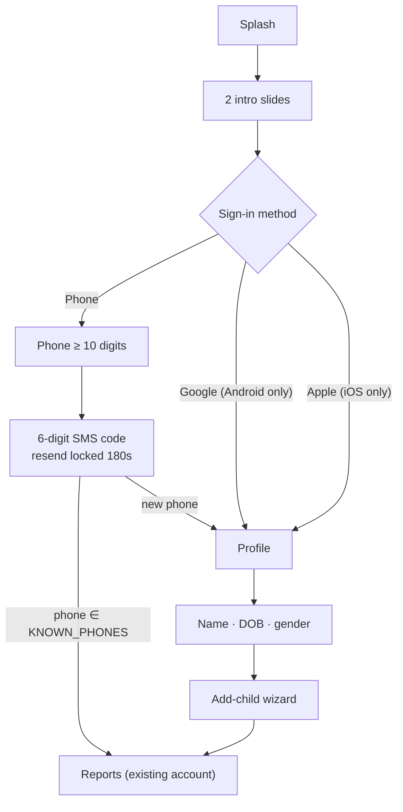

> **Prototype reality:** `verifyCode()` accepts **any** complete 6-digit code. `KNOWN_PHONES`
> (`['010-1234-5678', '01012345678']`) decides whether you are treated as an existing account. No
> token, no session, no server. **Email sign-in is `enabled: false`, not deleted** — flip the flag to
> add it (F-33.1).

### 5.2 Child pairing — there is no child login

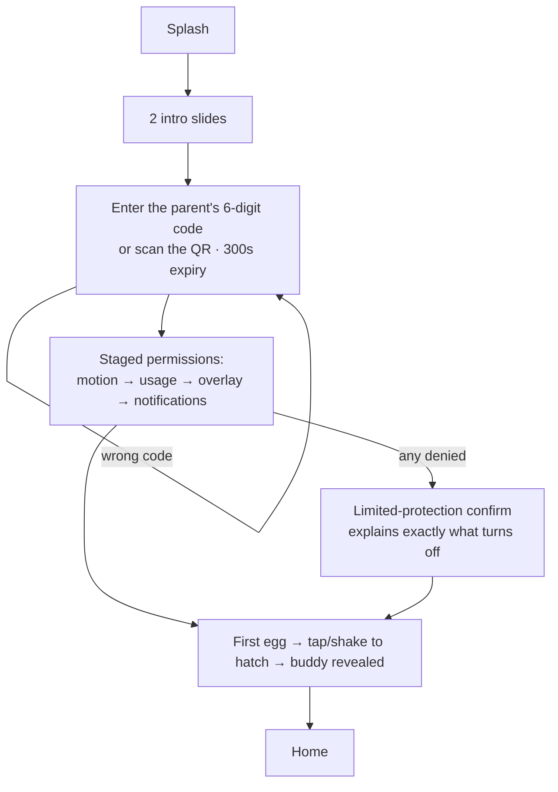

#### The four permissions (F-26) — verbatim reasons

| Permission | Why it's needed | If denied |
|---|---|---|
| **Motion · Activity recognition** | "Needed to tell whether you are walking." | "JoanX can't tell when you start walking, so warnings won't trigger." |
| **Usage access** | "Needed to know when the screen is on and which apps are in use." *(It never reads your messages.)* | "Warnings are limited." |
| **Display over other apps** | "Needed to show a warning when it's dangerous." → opens a system settings sheet | "Smart mode warnings are limited. Vibration and notifications still work." |
| **Notifications** | "Needed to receive rewards and guidance." | "You won't receive reward and guidance alerts." |

**Design note:** each is requested *one at a time, with its reason*, and denying one does **not**
dead-end the flow — it offers *limited protection* and explains precisely what stops working. That is
F-26's "staged permissions & fallback", and it is the difference between a child who understands the
app and a child who taps *Deny* on a wall of dialogs.

### 5.3 Earn → spend → grow

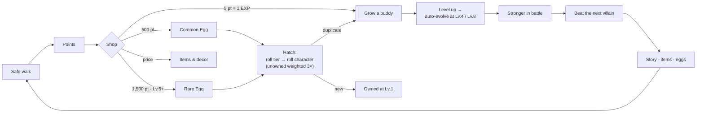

### 5.4 CRUD

**There is no CRUD against a server.** Every "write" mutates the in-memory model and is lost on
reload. The complete list of mutation points:

| Operation | Function / site | Mutates |
|---|---|---|
| **Create** (character) | `awardCharacters()`, `hatchEgg()` | `character.owned`, `.level = 1`, `.xp = 0` |
| **Create** (egg) | `awardEggs()` | `PLAYER.eggs`, `PLAYER.eggGrants` |
| **Create** (item) | `awardItems()`, `buyItem()` | `item.owned`, `PLAYER.itemGrants` |
| **Create** (risk event) | `logRiskEvent()` | `RISK_EVENT_LOG` (append-only) |
| **Update** (points) | `buyItem()`, `convertPointsToXp()`, `Battle.jsx` | `PLAYER.points` |
| **Update** (XP / level / stage) | `gainXp()` | `character.xp`, `.level`, `.stage`, `.maxed`, `.xpMax` |
| **Update** (battle record) | `Battle.jsx` `start()` | `villain.defeated`, `villain.clears`, `PLAYER.battlesToday` |
| **Update** (settings) | `setXpCurve` / `setStages` / `setStatGrowth` / `setExchange` | The config objects, **in place** |
| **Read** | Every screen, by importing `data.jsx` | — |
| **Delete** | **Nothing is ever deleted** | — |

### 5.5 Notifications
`Notifications.jsx` renders a static feed, filtered by `FEATURES.dangerZones`. **No push service
exists**; the parent's notification toggles write to local state only.

### 5.6 Error handling

| Case | Behaviour | Where |
|---|---|---|
| Wrong pairing code | Inline error + `jx-shake` + retry | `Onboarding.jsx` |
| Permission denied | Explains what turns off; offers limited protection | `Onboarding.jsx` |
| Not enough points | Toast: *"Not enough points yet"* | `CharacterVariants.jsx` |
| Item stage-gated | Toast: *"Unlocks at Stage 3"* | ↑ |
| Item level-gated | Toast: *"Unlocks at Lv 8"* | ↑ |
| Out of daily battles | CTA disabled: *"That's your battle for today"* | `Battle.jsx` |
| Offline / loading / empty / limited | **Demo states** from the Tweaks panel — *not real detection* | `App.jsx` |
| Any JS exception | **Unhandled** — no error boundary, no global handler | — |

### 5.7 Logout & admin
Sign-out is a `ParentDetail.jsx` sub-page (UI only). **There are no admin flows** — ops control is
data (`enabled` flags, server settings), not a screen.

---
---

# Part II — The design

## 6. Information Architecture

### 6.1 The shell

`src/shell/App.jsx` (384 lines) is not a website — it's a **prototype harness**. Five topbar segments
swap the entire experience:

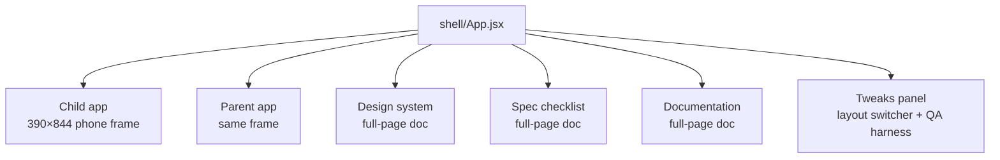

### 6.2 Navigation model

```js
const [screen, setScreen] = React.useState('home');
const [stack, setStack]   = React.useState([]);

nav(s, p)   → setStack([...stack, {screen, params}]); setScreen(s); setParams(p);
back()      → pop the stack; land on 'home' when empty
tabTo(root) → clear the stack, set the tab root
```

- **Child tabs:** Home · Collection · **Battle** (raised centre) · Friends · Profile.
- **Parent tabs:** Reports · Children · **Connect** (centre) · Activity · Account.
- Sub-screens remap to their parent tab: `chardex` and `villaindex` highlight *Collection*;
  `myhouse` and `decorate` highlight *Profile*.
- **The parent app has no back stack** — `nav()` simply swaps the screen.
- The tab bar hides entirely on `battle` (child) and on the pairing screens (parent).

### 6.3 Screen inventory — 45 files

**Child (32 files, 11,148 lines)**

| Area | Files | Variants |
|---|---|---|
| Home & status | `ChildHome` · `HomeVariants` · `HomeVariantsSimple` · `SafetyStatus` | 6 + 7 layouts |
| Safety | `WarningOverlay` (545) · `LiteBlock` (parked) | 3 warning styles × 5 message styles |
| Collection | `Collection` · `CollectionVariants` · `CharacterDetail` · `CharacterVariants` · `CharacterDex` · `CharacterDexVariants` · `DexHeaders` · `VillainDex` | 20 · 5 · 11 · 13 · 2 |
| Battle | `Battle` (306) · `BattleVariants` (2,877) | ~38 |
| Economy | `Shop` (430) · `Rewards` · `EggHatch` | |
| Social | `Friends` (767) · `AddFriends` (569) · `FriendHouse` · `Guestbook` · `MyHouse` · `DecorateRoom` | 35 · 25 |
| Account | `Profile` · `Notifications` · `HelpSupport` · `AboutJoanX` | |
| Onboarding | `Onboarding` (601) | |
| Shared | `shared.jsx` · `index.jsx` | |

**Parent (13 files)** · **Docs (3 files)** — full detail in
[Appendix D](#appendix-d--screen-reference).

### 6.4 Deep links

| Param | Values | Effect |
|---|---|---|
| `?view=` | `design` · `checklist` · `docs` | Open a doc page instead of the app |
| `?detail=` | `char-showcase` · `char-cover` · `char-focus` · `char-wave` · `char-vivid` · `char-original` | Open the buddy detail in that layout |
| `?home=` | `simple-focus` (default) · `simple-map` · `bento` · `arcade` · … | Choose the home layout |
| `#id` | any section id | Scroll a doc page to that section |

---

## 7. UI / UX Documentation

### 7.1 The design-system stack

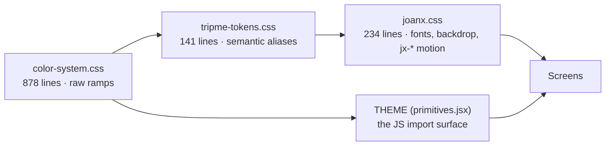

Ramps: **sand · ocean · rust · evergreen · ember · iris · sakura · tropic · data-yellow.**

### 7.2 Colour tokens

| Role | Token | Hex | Ramp step |
|---|---|---|---|
| Primary (in-game action) | `THEME.primary` | `#447aaf` | ocean-50 |
| | `THEME.primaryDark` | `#2b5782` | ocean-60 |
| | `THEME.primaryLight` | `#ecf3fe` | ocean-10 |
| **Product brand** (buddy green) | `THEME.brand` | `#4B814F` | — |
| Danger | `THEME.danger` | `#d14532` | rust-50 |
| Success | `THEME.success` | `#4b814f` | evergreen-50 |
| Warning | `THEME.warning` | `#b16120` | ember-50 |
| Points / XP | `THEME.gold` | `#d19900` | data-yellow-50 |
| Ink | `fg1 / fg2 / fg3` | `#2b2926` / `#585450` / `#b0adab` | sand-80 / 60 / 40 |
| Surfaces | `surface / surface2 / border` | `#ffffff` / `#f8f7f7` / `#ebebea` | sand-0 / 10 / 20 |
| Rarity | `rCommon / rRare / rEpic` | `#b0adab` / `#447aaf` / `#7f63c5` | sand-40 / ocean-50 / iris-50 |

**Two palettes by design:** ocean is the *in-game action* colour; the buddy green is the *product*
brand. They are not interchangeable, and the code says so.

#### `screenBgFor(color)` — the cleverest 20 lines in the styling layer

Derives the soft top-of-screen wash from whatever buddy/brand colour is active: hex → HSL → rotate the
hue → three stops. It carries a **neon guard**:

```js
const NEON = 0.80;                       // above every comic buddy (max s ≈ .72)
const isNeon = hex => _toHsl(hex)[1] > NEON;
```

Colours above `s > 0.80` take a *pastelising* path instead, because the naive additive lightness shift
turns a saturated magenta **fluorescent pink**. Hence the standing rule in the code:
**use `tint()` to lighten an accent, never `shade()`.**

### 7.3 Typography

| Face | Where | Why |
|---|---|---|
| **Fredoka** + **Jua** | `.game-font` — headers, numbers, mascot names | Rounded, kid-facing |
| **Pretendard** | Korean UI | The de-facto Korean app font (Toss/Naver) — stops Korean falling back to a system serif |
| System sans | Parent chrome | Neutral, adult |

### 7.4 Components (`src/core/primitives.jsx`, 262 lines)

Full prop tables in [Appendix C](#appendix-c--component-api-reference). Summary:

`Icon` · `Button` (7 variants × 3 sizes) · `Badge` · `Card` · `Input` · `Bar` · `Toggle` ·
`SectionHead` · `StatusBar`
— plus `child/shared.jsx`: `ScreenHeader` · `StageUpMoment` · `HatchCelebration` · `Confetti` ·
`RarityPill` · `DexProgress` · `PointsChip` · `StatCard`.

### 7.5 The mascot system (`core/characters.jsx`, 919 lines)

**Seven art styles behind one dispatcher.** `<Mascot>` reads a global (`window.JX_CHAR_STYLE`) and
routes:

| Style | Kind | Assets | Status |
|---|---|---|---|
| `comic` | `` SVG | `/assets/characters/comic/*.svg` | ✅ **The default, shipping style** |
| `cute` | `` PNG | `/assets/characters/cute/*.png` | ✅ Working |
| `toy` | `` PNG | `/assets/characters/3d/*` | ❌ **The directory does not exist — renders broken** |
| `classic` | Inline SVG | — | ✅ Fallback; parametric, recolours per buddy |
| `kr` · `toon` · `soft` | Inline SVG | — | ✅ Alternative art registers |

Inline-SVG styles support **3 stages × mood (happy / alert / sleepy / proud) × any colour**, and
recolour without a new request. Stage gear is drawn in: a scarf at Stage 2, a cape + shield badge at
Stage 3.

### 7.6 Motion — every animation is a `jx-*` class

| Class | Duration | Use |
|---|---|---|
| `jx-float` | 3.2 s ∞ | Idle buddy bob |
| `jx-pop` | .42 s | Reward / result reveal (spring easing) |
| `jx-press` | .12 s | Tactile button feedback |
| `jx-rise` · `jx-sheet-up` · `jx-overlay-up` | .4 s | Entrances |
| `jx-pulse` · `jx-ring` · `jx-ring-slow` · `jx-pulse-soft` | ∞ | Waiting / attention |
| `jx-skeleton` | 1.3 s ∞ | Loading shimmer |
| `jx-confetti` · `jx-burst` · `jx-gift-pop` | .6–1.6 s | Celebration |
| `jx-shake` | — | Wrong code |
| `jx-scan` | 2.4 s ∞ | QR scan line |
| `jx-twinkle` · `jx-drop-in` · `jx-spin` | — | Misc |

### 7.7 UX rules learned the hard way

These are **real constraints in this project**, arrived at through review:

| Rule | Why |
|---|---|
| **No glow shadows** on buttons/cards | They read as "AI design" |
| **No sparkles, faded icon watermarks, or dotted progress bars** | Same |
| **No motion on static lists** | Motion belongs on the thing being tapped, not on a list of eggs |
| **Waiting states use mascot + ripple** | Never a QR/checkmark pill |
| **Mascots must feel lively and asymmetric** | Stiff, symmetric poses read as clip-art |

### 7.8 Accessibility — honest audit

**What exists**
- ✅ `prefers-reduced-motion` respected (3 media queries in `joanx.css`).
- ✅ Real `<button>` elements for actions — no click-handlers on `div`s.
- ✅ Some `aria-label`s on icon-only buttons (back, dex, colour swatches).
- ✅ `autoComplete="one-time-code"` on the SMS input.
- ✅ `:focus` is not suppressed.

**What is missing**
- ❌ **No custom visible focus ring** — the browser default is all you get.
- ❌ **Most icon-only buttons are unlabelled.**
- ❌ **No `role` / `aria-live` on toasts or the warning overlay.** A screen-reader user is *never told
  a warning appeared.* **This is unacceptable in a safety feature** and is the top of the a11y
  backlog ([RISK-3](#appendix-g--risk-register)).
- ❌ No skip link, no automated a11y test, no verified WCAG contrast audit.
- ❌ Colour is sometimes the only cue (e.g. rarity), though a label usually accompanies it.

### 7.9 State design

| State | Implementation |
|---|---|
| **Loading** | `jx-skeleton` shimmer (`Collection.jsx` has a dedicated `Sk` component) |
| **Empty** | Demo toggle in Tweaks → first-run empty states |
| **Error** | Inline messages + `jx-shake` |
| **Success** | `Confetti` · `HatchCelebration` · `StageUpMoment` |
| **Offline** | Demo state → "protection paused" |
| **Limited** | Demo state → a permission is off → limited-protection banner |

### 7.10 Responsive

The apps render in a fixed **390 × 844** bezel; the stage scales to the viewport:

```js
scale = Math.max(0.5, Math.min(1, (window.innerHeight - 96) / 844))
```

Under **720 px** the Tweaks panel becomes a static block below the phone. The three doc pages are
genuinely responsive (sidebar → horizontal nav at **900 px**).

---
---

# Part III — The engineering

## 8. Frontend Architecture

### 8.1 Folder structure

```
src/
├─ main.jsx            # boot: 3 stylesheets → <App/>. No router, no providers, no StrictMode
├─ shell/App.jsx       # the harness: role switch, screen registry, nav stack, Tweaks panel  (384)
├─ core/
│  ├─ data.jsx         # THE model + ALL business logic — imports no screen              (1,528)
│  ├─ characters.jsx   # 7 Mascot renderers + colour helpers                               (919)
│  ├─ i18n.jsx         # L(), en/ko dictionary (1,201 keys)                                 (872)
│  ├─ primitives.jsx   # THEME + UI kit                                                     (262)
│  ├─ auth.jsx         # AuthFlow: phone → SMS → profile                                    (218)
│  └─ nav.jsx          # TabBar + tab definitions                                            (70)
├─ child/    32 files, 11,148 lines
├─ parent/   13 files
├─ docs/     DesignSystem (1,096) · SpecChecklist (467) · ProjectDocs (913)
└─ styles/   tripme-tokens.css (141) → color-system.css (878) → joanx.css (234)
```

### 8.2 Routing — there isn't any

**No `react-router`.** Navigation is state (see [§6.2](#62-navigation-model)). Rationale in
[ADR-002](#appendix-f--architecture-decision-records-adrs).

### 8.3 State management — three tiers

| Tier | What | Where |
|---|---|---|
| **1. Shell state** | role, screen, stack, params, language, demo states, the `tw` tweaks object | `App.jsx` |
| **2. Screen-local state** | `useState` per screen (e.g. `Battle.jsx`: `phase`, `sel`, `won`, `targetLv`) | Each screen |
| **3. The mutable domain model** | `PLAYER`, `CHARACTERS`, `VILLAINS`, `ITEMS` — **module-level objects screens mutate directly** | `core/data.jsx` |

**React is not the source of truth. The data module is.**

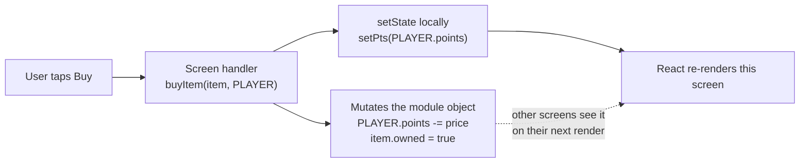

> **This is the biggest architectural trade-off in the repo.** Correct for a prototype; the first
> thing to replace in production. See [ADR-003](#appendix-f--architecture-decision-records-adrs) and
> [RISK-1](#appendix-g--risk-register).

### 8.4 The `ctx` prop — the only prop any screen receives

```js
ctx = { nav, back, tabTo, params, mode, setMode, demo, setDemo, tweaks,
        openOverlay, closeOverlay, setBuddy, lang, setLang,
        finishOnboarding, finishParentOnboarding }
```

Nothing is prop-drilled below it. Screens read domain data by importing `data.jsx` directly — which
is why the dependency graph is a *tree*, not a web.

### 8.5 Styling
Inline `style={{}}` objects driven by `THEME`, plus `jx-*` classes for animation. No Tailwind, no
CSS-in-JS, no CSS modules. Doc pages inject one template-literal stylesheet each (`DS_CSS`, `CL_CSS`,
`DOC_CSS`). Rationale in [ADR-005](#appendix-f--architecture-decision-records-adrs).

### 8.6 Naming conventions

| Pattern | Meaning |
|---|---|
| `PascalCase.jsx` | A component; the file name is the component name |
| `*Variants.jsx` | A **gallery** of alternative layouts for one screen, switchable from Tweaks |
| `SCREAMING_SNAKE` | A domain constant / table |
| `camelCase()` | A derived helper or a rule function |
| `// F-16 · A-3.1` in a comment | **The spec ID this code implements** |

That last one is the convention that matters most: it is what makes the Spec checklist an *audit*
rather than an aspiration.

### 8.7 Performance optimisations present
**Almost none, deliberately.** No `React.memo`, no `useMemo`, no code splitting, no lazy routes.
→ [§17](#17-performance).

---

## 9. Backend Architecture

> **There is no backend.** No server, controllers, services, middleware, queue, cache, storage or
> logging pipeline. An exhaustive search finds **no `fetch`, no `axios`, no WebSocket** anywhere in
> `src/child`, `src/parent`, `src/core`, `src/shell` or `src/docs`.

### 9.1 The contract the prototype implies

| Concern | What the server must own | Today's stand-in | Ready? |
|---|---|---|---|
| **Settings** | The economy: EXP curve, stages, stat growth, exchange, points, intervention, battle rewards, egg odds | `setXpCurve()` · `setStages()` · `setStatGrowth()` · `setExchange()` | ✅ The exact functions a payload calls |
| **Ledgers** | `eggGrants` · `charUnlocks` · `itemGrants` (*"server-owned in the shipped app"*) | Maps on `PLAYER` | ✅ Shape is final |
| **Event ingest** | Risk events (**F-24 `POST /event`**) | `RISK_EVENT_LOG` (in memory) | ✅ Client half exists |
| **Reports** | Parent-dashboard aggregates | `CHILD_REPORTS`, `PARENT_METRICS` | ✅ Shape is final |
| **Auth** | Phone + SMS OTP, Google/Apple | `AuthFlow` accepts any 6-digit code | ⚠️ UI only |
| **Pairing** | Issue / validate / expire 6-digit codes | `LINK.code = '482193'` | ⚠️ UI only |
| **Economy authority** | Points, purchases, hatch rolls, battle resolution | **Client-side mutation** | ❌ **Fatal in production** |

### 9.2 The only real I/O in the entire repository

1. `src/overview/design-canvas.jsx` — a **design tool**, not part of the app: `fetch()` of a local
   `.design-canvas.state.json`, plus `fetch()` to inline images/fonts on PNG export.
2. Google Fonts / jsDelivr `@import` in `joanx.css`.
3. `localStorage` — the Spec checklist's review checkboxes (`jx-spec-checklist-v1`).
4. `DeviceMotionEvent` — shake-to-hatch (`EggHatch.jsx`). **The one real device API in use**, including
   the iOS 13 `requestPermission()` dance.

---

## 10. Database Documentation

> **No database exists** — no schema, migration, ORM, SQL, index or foreign key. What follows is the
> **entity model the mock data defines**, i.e. what a production schema must store. Field names are
> the real ones from `src/core/data.jsx`.

### 10.1 Entity–relationship

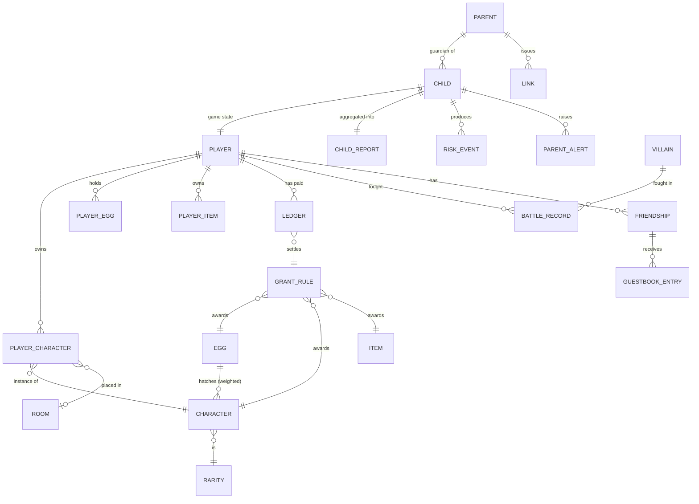

### 10.2 Proposed tables

| Table | Key fields | Notes |
|---|---|---|
| `parent` | `id` **PK** · `phone` **UNIQUE** · `name` · `dob` · `created_at` | The only real account |
| `child` | `id` **PK** · `parent_id` **FK** · `name` · `age` · `mode` · `device` · `online` | 3 seeded (`k1`–`k3`) |
| `link` | `id` **PK** · `parent_id` **FK** · `child_id` **FK** · `code` · `expires_at` · `since` | Pairing; code **single-use, expiring** |
| `player` | `child_id` **PK/FK** · `points` · `streak` · `level` · `xp` · `safe_km` · `safe_minutes` · `phone_use_drop` · `battles_today` · `active_char_id` **FK** · `friend_code` **UNIQUE** · `house_bg` | `xp_max`, `maxed`, `stage` are **derived, never stored** |
| `character` | `id` **PK** · `species` · `name` · `color` · `rarity` · `set` · `traits` jsonb | Catalogue (15 rows) |
| `player_character` | `player_id` **FK** · `character_id` **FK** · `level` · `xp` · `room_id` **FK** · **PK(player, character)** | Ownership + progress |
| `egg` | `id` **PK** · `rarity` · `price` NULLABLE · `min_level` · `odds` jsonb · `enabled` | `price NULL` = reward-only |
| `player_egg` | `player_id` **FK** · `egg_id` **FK** · `qty` | Unhatched holdings |
| `item` | `id` **PK** · `category` · `slot` · `price` · `min_stage` · `min_level` · `limited` · `set` | **One table**; outfits / decor / backgrounds are *views* |
| `player_item` | `player_id` **FK** · `item_id` **FK** · `acquired_via` | |
| `villain` | `id` **PK** · `lv` · `role` · `power` · `risk` · `personality` · `story` · `look` · `ability` jsonb · `set` · `enabled` | 10 rows |
| `battle_record` | `player_id` **FK** · `villain_id` **FK** · `clears` · `first_cleared_at` | Drives sequential unlock |
| `grant_rule` | `id` **PK** · `kind` (egg/char/item) · `source` · `when` jsonb · `repeatable` · `enabled` · `label` | The three grant tables, unified |
| **`ledger`** | `player_id` **FK** · `rule_id` **FK** · `times_paid` · **PK(player, rule)** | **The double-payment guard** |
| `risk_event` | `id` **PK** · `child_id` **FK** · `outcome` · `rounds` · `tier` · `at` | Append-only; feeds rewards **and** the report |
| `child_report` | `child_id` **FK** · `period` · `acceptance` · `safe_walk_min` · `avg_response` · `streak` · `reactions` jsonb · `risk` jsonb | Materialised aggregate |
| `settings` | `key` **PK** · `payload` jsonb · `version` | The economy — see [§11](#11-api-documentation) |

### 10.3 Indexes that matter

| Index | Why |
|---|---|
| `risk_event (child_id, at DESC)` | The report query is *"last 7 days for this child"* |
| `ledger (player_id, rule_id)` **PK** | Read on **every** grant check — must be a point lookup |
| `player_character (player_id)` | Renders the collection on nearly every screen |
| `link (code)` **UNIQUE**, partial `WHERE expires_at > now()` | Pairing-code redemption |
| `player (friend_code)` **UNIQUE** | Friend lookup by code |
| `battle_record (player_id, villain_id)` **PK** | Sequential-unlock check |

### 10.4 Data flow

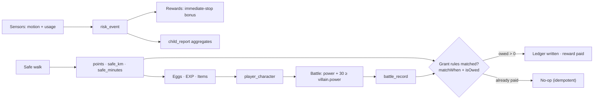

---

## 11. API Documentation

> **No API exists in this repository.** The spec names exactly one endpoint (**F-24 `POST /event`**),
> whose client half is `logRiskEvent()`. Everything below is the **contract implied by the code** —
> offered to the backend team, and clearly *proposed*, not *existing*.

### 11.1 Proposed endpoint map

| Endpoint | Method | Auth | Purpose | Client stand-in today |
|---|---|---|---|---|
| `/auth/phone` | POST | — | Request an SMS OTP | `AuthFlow` phone step |
| `/auth/verify` | POST | — | Verify the code, return a session | `verifyCode()` (accepts anything) |
| `/link/code` | POST | Parent | Generate a pairing code | `LINK.code` |
| `/link/redeem` | POST | — | Child redeems the code | `Onboarding.jsx` |
| `/settings` | GET | Child | The whole economy payload | The four setters |
| `/event` | POST | Child | **F-24** risk-event ingest | `logRiskEvent()` |
| `/progress/claim` | POST | Child | Award everything owed | `claimRewards()` |
| `/shop/buy` | POST | Child | Buy an item or an egg | `buyItem()` |
| `/egg/hatch` | POST | Child | Hatch — **the server must roll** | `hatchEgg()` |
| `/battle/resolve` | POST | Child | Resolve a challenge | `Battle.jsx` `start()` |
| `/reports/:childId` | GET | Parent | Dashboard aggregates | `CHILD_REPORTS` |
| `/children/:id/settings` | PATCH | Parent | F-22 intervention config | `ParentSettings.jsx` |

### 11.2 `GET /settings`

**Auth:** child session. **Permission:** own settings only.

```jsonc
// 200 OK — this exact shape is what setXpCurve() / setStages() / setStatGrowth() / setExchange() consume today
{
  "xpCurve":    { "maxLevel": 10,
                  "steps": [100, 120, 150, 180, 220, 270, 330, 400, 480],
                  "growth": 1.2, "roundTo": 10 },
  "stages":     [ { "stage": 1, "minLevel": 1 },
                  { "stage": 2, "minLevel": 4 },
                  { "stage": 3, "minLevel": 8 } ],
  "exchange":   { "pointsPerXp": 5, "stepXp": 10 },
  "statGrowth": {
    "base":     { "common": { "hp": 100, "courage": 40, "protection": 40, "speed": 40 },
                  "rare":   { "hp": 120, "courage": 50, "protection": 48, "speed": 46 },
                  "epic":   { "hp": 150, "courage": 62, "protection": 58, "speed": 55 } },
    "perLevel": { "common": { "hp": 12,  "courage": 4,   "protection": 4,   "speed": 4 },
                  "rare":   { "hp": 16,  "courage": 5.5, "protection": 5,   "speed": 5 },
                  "epic":   { "hp": 22,  "courage": 7,   "protection": 6.5, "speed": 6 } }
  }
}
```

**Client error behaviour is already implemented:** any field missing or malformed falls back to the
launch default, **per field**, so a bad response degrades to the shipped economy rather than breaking
the game. A `steps` array containing a string, or a `maxLevel` of `0`, is rejected wholesale.
*Verified:* `setXpCurve({steps: [100, 'oops', -5], maxLevel: 0, growth: null})` restores the defaults
exactly.

### 11.3 `POST /event` (F-24)

**Auth:** child session. **Idempotency:** required (`event_id`).

```jsonc
// request
{ "eventId": "6f1e…",       // idempotency key
  "outcome": "immediate",    // immediate | delayed | ignored
  "rounds": 1,               // how many intervention rounds it took
  "tier": "gentle",          // gentle | firm | urgent
  "at": "2026-07-14T08:12:04Z" }

// 201 Created — the server decides the reward; the client never does
{ "pointsAwarded": 20, "streakDays": 5, "grantsPaid": [] }
```

| Status | When |
|---|---|
| `400` | Unknown `outcome` / `tier` |
| `401` | No session |
| `409` | Duplicate `eventId` — return the original result, do not re-award |
| `429` | Event flood (rate limit) |

### 11.4 `POST /shop/buy`

```jsonc
// request
{ "itemId": "goggles" }

// 200 OK
{ "ok": true, "points": 920, "item": { "id": "goggles", "owned": true } }

// 422 — the verdict vocabulary already exists in canBuyItem()
{ "ok": false, "reason": "level",        "need": 8 }
{ "ok": false, "reason": "stage",        "need": 3 }
{ "ok": false, "reason": "points",       "need": 320 }
{ "ok": false, "reason": "owned" }
{ "ok": false, "reason": "not-for-sale" }
```

### 11.5 `POST /progress/claim`

The one endpoint that must be **idempotent by construction** — it is the server's `claimRewards()`.

```jsonc
// request  (the client sends nothing but its session; the server owns the context)
{}

// 200 OK
{ "eggs":       [ { "eggId": "common", "qty": 1, "ruleId": "g-km-every" } ],
  "characters": [ { "characterId": "c16", "ruleId": "u-streak-7" } ],
  "items":      [] }
```

**The ledger is what makes a repeat call safe:** a second call with no new progress returns three
empty arrays.

### 11.6 The rule the backend must not break

> **The hatch roll, the battle outcome, and every point mutation must be server-side.**

Today they are client-side — correct for a prototype and **fatal in production**: a client mutation
could grant infinite points. The existing client functions (`hatchEgg`, `battlePower`, `buyItem`) then
become *predictions* for optimistic UI, with the server's answer authoritative.

---

## 12. Business Logic

All of this lives in `src/core/data.jsx`. Full signatures in
[Appendix B](#appendix-b--function-reference-coredatajsx).

### 12.1 The EXP engine

```js
xpForLevel(level)   // null at the cap; steps[level-1]; beyond the table: last × growth^n, rounded up
gainXp(c, amount)   // the SINGLE xp path — battles, duplicate hatches, the point exchange
```

`gainXp` **carries overflow across levels**, recomputes `maxed` / `xpMax`, re-derives `stage`, lifts
`player.level`, and returns:

```js
{ gained, levels, lost, stageUp }   // `lost` = XP that hit the cap and had nowhere to go
```

**Worked example.** Hammy is Lv.7 with 320/330 XP. `gainXp(hammy, 200)`:

| Step | Left | Action |
|---|--:|---|
| Lv.7 needs 330 − 320 = 10 | 200 | Fill it → level 8, xp 0, `levels: 1` |
| Lv.8 needs 400 | 190 | 190 < 400 → xp = 190 |
| — | 0 | `stage` re-derived: Lv.8 ⇒ **Stage 3** |

Returns `{ gained: 200, levels: 1, lost: 0, stageUp: 3 }` — and the buddy visibly evolves.

### 12.2 The stat & battle engine

| Function | Formula |
|---|---|
| `affinityOf(c)` | `0.8 + trait/250` per stat, leaning on `traits.guard / speed / heart` |
| `statsFor(c)` | `round((base[rarity] + perLevel[rarity] × (level − 1)) × affinity)` |
| `battlePower(c)` | `courage + protection + speed + hp/5` |
| `statMax(key)` | Per-stat ceiling at the cap × 1.2, rounded to 10 — so HP and Courage don't share a scale |
| **Win condition** | `battlePower(buddy) + 30 ≥ villain.power` |

### 12.3 The grant engine — one matcher, three reward types

The most reusable thing in the codebase.

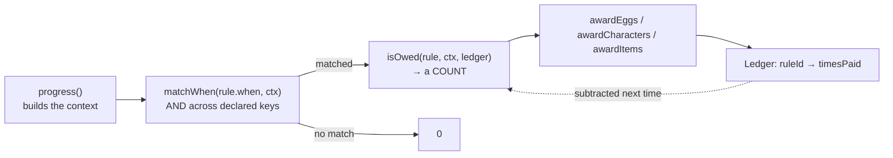

```js
matchWhen(w, ctx)        // AND of: metric(reach|every) · missions · achievement · event
                         //         streakDays · villainsDefeated · atLevel · everyLevels
grantPayouts(rule, ctx)  // repeatable: floor(safeKm / every) · floor(level / everyLevels)
isOwed(rule, ctx, paid)  // max(0, (repeatable ? grantPayouts(...) : 1) − (paid[rule.id] || 0))
```

**Why a count and not a boolean.** A child who walks 80 km before the app next checks is owed *three*
25-km eggs, not one. And because the ledger is subtracted, a one-shot rule **settles forever** once
paid — which is what stops a milestone re-awarding on every render.

> **That single choice is what makes the entire reward engine idempotent** — and it is why the future
> `POST /progress/claim` can be safely retried.

`claimRewards()` runs all three faucets in one call, so a walk that ends can pay an egg, a character
**and** an item without the caller remembering to ask three separate systems.

### 12.4 The hatch algorithm

```js
rollRarity(egg)   // weighted roll over the egg's odds → a tier
hatchEgg(egg)     // then: bag = pool.flatMap(c => Array(c.owned ? 1 : 3).fill(c))   // unowned 3×
```

### 12.5 Server-configurable seams

| Table | Setter | Validation |
|---|---|---|
| `XP_CURVE` | `setXpCurve()` | `maxLevel ≥ 2` · `steps` = non-empty array of finite positives · `growth ≥ 1` · `roundTo ≥ 1` |
| `STAGES` | `setStages()` | Bails unless ≥ 1 row has numeric `stage` + `minLevel ≥ 1`; re-sorts; calls `applyXpCurve()` |
| `STAT_GROWTH` | `setStatGrowth()` | Per-rarity, per-stat; only finite `≥ 0`. **A `stageMult` in the payload is ignored on purpose** |
| `EXCHANGE` | `setExchange()` | Both fields `≥ 1` — `pointsPerXp: 0` would divide by zero |
| `POINTS` · `INTERVENTION` · `BATTLE_REWARDS` · `EGGS` | *(no setter yet)* | Documented as remote-settings-owned |

**Shared discipline:** anything omitted or malformed → the launch default · mutation is **in place**
(so existing importers see the retune without re-importing) · any setter that changes derived state
calls `applyXpCurve()`.

### 12.6 Conditional flows & automation

| Behaviour | Rule |
|---|---|
| **Evolution** | Automatic on level-up (`stageForLevel`), never a button |
| **Sequential unlock** | `villainUnlocked(v)` = "is the one before it beaten?" |
| **The ending** | `endingUnlocked()` = "is the villain **with the `finalBoss` role** beaten?" |
| **Seasons** | `enabled: false` rows are invisible everywhere. Already authored and dark: `g-spring-26`, `u-event-spring`, three `i-winter-*` items |
| **Daily reset** | `PLAYER.battlesToday` — session-only in the prototype |

### 12.7 Background jobs
**None.** In production, the ledger sweep (`claimRewards`), the daily battle-count reset, and the
streak roll-over are server-side jobs. Today they are in-memory and session-only.

### 12.8 Balance analysis — who can actually beat Nox?

Because the win condition is arithmetic (`power + 30 ≥ villain.power`), the difficulty curve can be
*checked*, not argued about. Running the real `battlePower()` at neutral traits (50/50/50):

| Rarity | Lv.1 | Lv.5 | Lv.10 | **Effective at Lv.10** (+30) | vs. Nox (440) |
|---|--:|--:|--:|--:|---|
| Common | 140 | 198 | 270 | **300** | ❌ short by 140 |
| Rare | 168 | 243 | 337 | **367** | ❌ short by 73 |
| Epic | 205 | 301 | 421 | **451** | ✅ clears it |

And with the roster's real traits, at the level cap:

| Character | Rarity | Effective power | vs. Nox |
|---|---|--:|---|
| Mochi | Common | 316 | ❌ |
| Hammy | Rare | 401 | ❌ |
| Ember | **Epic** | 508 | ✅ |
| Zephyr | **Epic** | 510 | ✅ |

> ### 🔎 Finding: **the final boss is beatable only by an Epic.**
>
> A fully-grown *Rare* falls **39–73 short**, and no amount of levelling closes the gap — Lv.10 is the
> cap. This makes the guaranteed unlocks **load-bearing, not decorative**: an Epic comes from the Epic
> Egg (reward-only, never purchasable) or from a 30-day streak / a 50% drop in phone use.
>
> **The ending is therefore gated on sustained real-world behaviour change, not on spending.** That
> may well be the best thing about the design — a child *cannot buy their way to the ending, they have
> to earn it by walking safely for a month.* But it should be a **decision**, not an accident, and
> whoever tunes `BATTLE_REWARDS` next needs to know that lowering Nox's power below ~400 would quietly
> hand the ending to any maxed Rare, and that raising the Epic Egg's availability would shortcut a
> month of behaviour change.

*Method: computed with the module's own `battlePower()`, not estimated. Reproduce with
`activeVillains()` and `battlePower({ rarity, level, traits })`.*

---

## 13. Codebase Architecture

### 13.1 Dependency graph

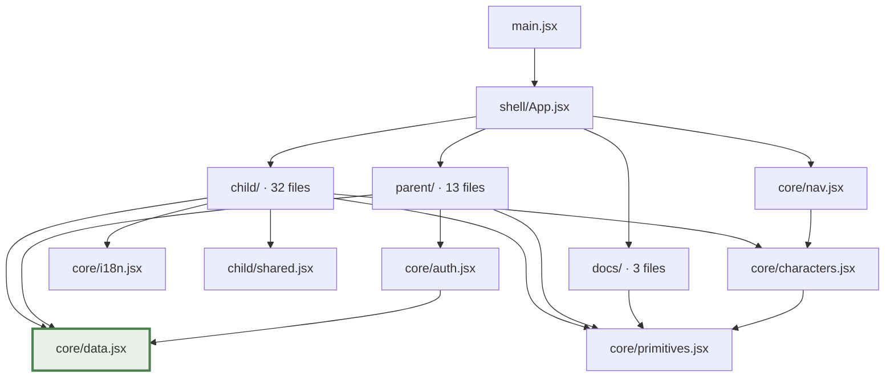

**`core/data.jsx` is the hub — and it imports nothing.** It is the bottom of the graph, which is
exactly what makes a balance change a one-file edit and stops a screen inventing its own rule.

### 13.2 Application lifecycle

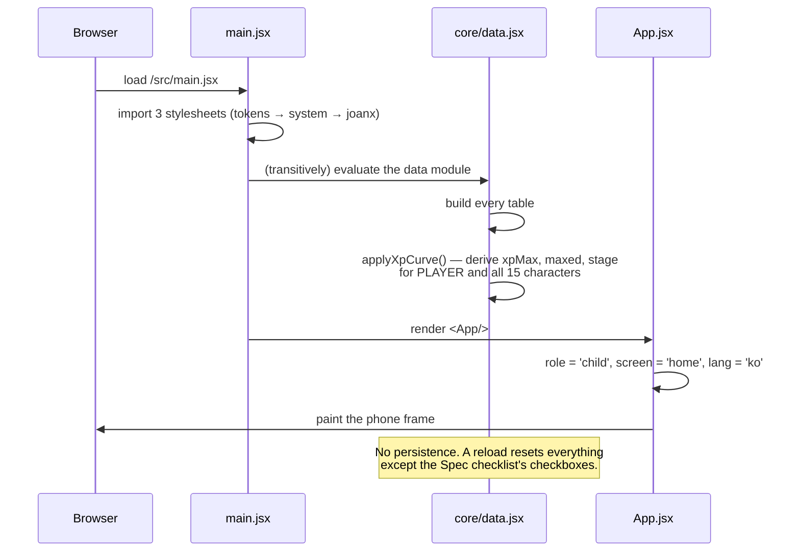

---

## 14. Tech Stack

| Layer | Choice | Version | Why |
|---|---|---|---|
| Language | JavaScript (ESM, JSX) | — | **No TypeScript** — see [ADR-006](#appendix-f--architecture-decision-records-adrs) |
| UI | React | ^18.3.1 | |
| Icons | lucide-react | ^0.469.0 | Behind a kebab-case `Icon` wrapper, so the library is swappable |
| Build | Vite + `@vitejs/plugin-react` | ^6.0.7 / ^4.3.4 | Multi-page build (app + 3 design pages) |
| Package manager | npm | — | `package-lock.json` |
| Hosting | Vercel | — | Static |
| Styling | Inline objects + CSS custom properties | — | |
| Fonts | Fredoka · Jua (Google) · Pretendard (jsDelivr) | — | |
| State | `useState` + mutable module objects | — | [ADR-003](#appendix-f--architecture-decision-records-adrs) |
| Router | **None** | — | [ADR-002](#appendix-f--architecture-decision-records-adrs) |
| Backend / DB / API | **None** | — | [ADR-001](#appendix-f--architecture-decision-records-adrs) |
| Tests / CI / Docker / linter | **None** | — | [RISK-2](#appendix-g--risk-register) |
| Third-party integrations | **None** | — | No analytics, no crash reporting, no payments |

---

## 15. DevOps

### 15.1 Commands

```bash
npm install      # 3 runtime deps, 2 dev deps
npm run dev      # Vite dev server → http://localhost:5173
npm run build    # → dist/  (multi-page: index + design/{colors,components,overview})
npm run preview  # serve the production build
```

### 15.2 Deployment

Static deploy to **Vercel**. The whole of `vercel.json`:

```json
{
  "cleanUrls": true,
  "headers": [{ "source": "/(.*)", "headers": [
    { "key": "Cache-Control", "value": "public, max-age=0, must-revalidate" }
  ]}]
}
```

`max-age=0, must-revalidate` means **every reviewer always sees the newest prototype** — the right
trade for a design-review artifact, and the wrong one for a production app.

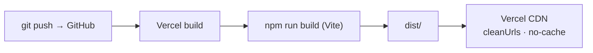

### 15.3 Environment variables, secrets, Docker, CI, monitoring
**None exist.** No `.env`, no `.github/`, no `Dockerfile`, no pipeline, no monitoring, no logging
service. Deployment is a push to `github.com/heinhtetag2/JoanX` (branch `main`).

### 15.4 Scaling
Not applicable — a static bundle on a CDN. Every scaling question belongs to the backend that does not
exist yet.

---
---

# Part IV — The quality bar

## 16. Security

**Be direct in an interview: there is no security surface here, because there is nothing to secure
yet.**

| Concern | Reality |
|---|---|
| Authentication | `AuthFlow` accepts **any** 6-digit code. No token, session or cookie |
| Authorization | Role is a React state string — anyone can switch to the parent app in the harness |
| JWT / session / cookies | None |
| Encryption | None — nothing is transmitted or stored |
| XSS | No `dangerouslySetInnerHTML` anywhere; React escapes by default |
| CSRF | N/A — no mutating requests exist |
| Rate limiting | N/A. `BATTLES_PER_DAY = 5` is a *game* limit, client-side only |
| Secrets | None in the repo |
| Dependency risk | 3 runtime dependencies — a very small attack surface |

### 16.1 What the design already gets right (and production must keep)

1. **Data minimisation** — the parent-visible model excludes **location, messages, photos** — and the
   child is *shown* that contract.
2. **No free-text channel between children** — six fixed stamps, enforced by the absence of an input.
3. **No GPS** in the in-scope build.
4. **The child holds no account** — no child credential to leak.
5. **Phone & Texts can never be blocked** — a child can always call for help.

### 16.2 What production must add

| Control | Detail |
|---|---|
| Real OTP | Expiry, attempt limits, rate limiting per phone and per IP |
| Signed session | Short-lived access token + rotation |
| **Server-authoritative economy** | Today a client mutation could grant infinite points |
| Pairing codes | Single-use, short expiry, brute-force resistant (6 digits = 10⁶ — needs lockout) |
| COPPA / GDPR-K | Verifiable parental consent, retention limits, export & delete |
| Transport | TLS, cert pinning on mobile |
| Secrets | A managed store; nothing in the repo |

→ [Appendix L](#appendix-l--privacy--compliance).

---

## 17. Performance

### 17.1 What exists
Vite's production build (tree-shaking, minification, hashed assets) · inline SVG mascots that recolour
without new requests · `transform` / `opacity`-only animation (no layout thrash) ·
`prefers-reduced-motion` respected.

### 17.2 What doesn't

| Technique | Status |
|---|---|
| Code splitting / lazy routes | **None.** One bundle; Vite warns it exceeds 500 kB |
| `React.memo` / `useMemo` / `useCallback` | **None** |
| Image optimisation | Raw `.png` / `.jpg` in `public/` |
| Caching | Deliberately defeated (`max-age=0`) |
| Virtualised lists | Not needed at this data size |

### 17.3 Why the bundle is big — and the fix

| File | Lines | What it is |
|---|--:|---|
| `BattleVariants.jsx` | 2,877 | ~38 battle-screen layouts |
| `Friends.jsx` | 767 | 35 friends layouts |
| `HomeVariantsSimple.jsx` | 733 | 7 home layouts |
| `AddFriends.jsx` | 569 | 25 add-friend layouts |
| `CollectionVariants.jsx` | 545 | 20 collection layouts |

These are **design inventory, not product code** — they exist so a client can choose a direction
*live, in the real app*, rather than in a slide deck. **Deleting the unchosen ones is the single
biggest performance win available**, the day the direction is signed off. → [Appendix M](#appendix-m--proposed-performance-budget).

---

## 18. Testing

**There is no test suite.** No runner in `package.json`, no CI, no linter config.

### 18.1 How the code is verified today

| Method | What it covers |
|---|---|
| **The Tweaks panel** | A hand-built QA harness: trigger a warning, replay onboarding, force offline/loading/limited/empty states, swap any screen layout — all without a code change |
| **The Spec checklist** | A per-requirement audit with persistent review checkboxes; a manual traceability matrix |
| **Browser-driven verification** | Headless Chrome driving real flows during development |

### 18.2 The test strategy this codebase is asking for

The domain logic is unusually testable: **pure functions over plain objects, in one file, with zero
React coupling.** Start there — it is the cheapest, highest-value work in the repo.

Full case list in [Appendix H](#appendix-h--qa-test-matrix). Summary:

| Layer | Target | Priority |
|---|---|---|
| **Unit** | `data.jsx` — 30+ concrete cases | 🔴 P0 |
| **Component** | `WarningOverlay` phase machine | 🔴 P0 (safety) |
| **Integration** | `Battle.jsx` reward tiers, daily cap | 🟠 P1 |
| **E2E** (Playwright) | Pair → permissions → hatch → walk → warning → stop → shop → battle → ending | 🟠 P1 |
| **Visual regression** | Doc pages + key screens | 🟡 P2 |
| **Accessibility** | axe on every screen | 🔴 P0 (the overlay is a safety feature) |

---
---

# Part V — The thinking

## 19. Product Decisions

Twelve decisions, each with its rationale and its cost. Formal ADRs in
[Appendix F](#appendix-f--architecture-decision-records-adrs).

| # | Decision | Why | Trade-off |
|---|---|---|---|
| 1 | **Motivation over restriction** — never seize the phone | A blocked child uninstalls; a motivated child keeps playing | Weaker hard-stop guarantee; relies on the game being genuinely fun |
| 2 | **Stages grant no stats** | Evolution stays a reward, not a requirement | Loses a lever for making evolution feel powerful |
| 3 | **Automatic evolution** | A manual button lets a Lv.8 buddy sit un-evolved because the child never opened the screen | Loses the "tap to evolve" beat — recovered via `StageUpMoment` |
| 4 | **Guaranteed unlocks beside the gacha** | An ethical guard-rail on a gacha aimed at children | Reduces pressure to buy eggs |
| 5 | **Stamps, not text, in the guestbook** | A free text box between two children is an unmoderated message channel | Less expressive social play |
| 6 | **Parent sees behaviour, not location** | Sells trust to the *child* as well as the parent | Loses a feature parents often ask for |
| 7 | **One item table, three views** | A new acquisition route lights up hats, wallpaper and furniture at once — not three times | A slightly less obvious data shape |
| 8 | **Economy as server settings, not code** | Balancing is business policy; retuning must not need a release | More validation code and a fallback path to maintain |
| 9 | **Roles, not row positions** (`finalBoss`) | An appended seasonal villain can never steal the ending | A little indirection |
| 10 | **Mutable module state instead of a store** | The fastest path to a spec-complete prototype | Not production-viable; a reload wipes everything |
| 11 | **Dozens of layout variants per screen** | A client chooses a direction live, in the real app | A large bundle and dead code to prune |
| 12 | **No TypeScript** | Iteration speed on a possibly-throwaway prototype | No compile-time safety on an intricate data model — **the strongest argument for TS in the rebuild** |

**Alternatives rejected in-code** (the comments name them):

| Rejected | Because |
|---|---|
| A linear EXP formula (`base + (n−1)×step`) | Cannot express the approved curve — it *bends* |
| `boss = last index` | Breaks the moment a seasonal villain is appended |
| `shade()` to lighten accents | Clamps saturated colours into fluorescent pink — hence `tint()` and the neon guard |
| A manual "Evolve" button | Lets a Lv.8 buddy sit un-evolved |
| A free-text guestbook | An unmoderated message channel between children |
| A stage stat multiplier | Turns a reward into an obligation |

---

## 20. Future Roadmap

### Product

| Item | Readiness |
|---|---|
| **Seasonal content** | 🟢 The seams exist — three winter items and two spring rules already ship dark |
| **Ending content** | 🟡 Beating Nox unlocks an ending; today that's a result panel. Build the epilogue |
| **Co-op / family goals** | 🔴 New design work |
| **A real AI parent report** | 🟡 The screen exists; wire it to a model over the true 7-day aggregate |
| **More villains / a second season** | 🟢 Add rows; the role/set model already supports it |

### Technical — in priority order

1. **Build the backend — server-authoritative first.** Today a client mutation could grant infinite
   points. The four setters, three ledgers and `logRiskEvent()` are the seams; none need reshaping.
2. **Add tests, starting with `data.jsx`.** Pure, isolated, rule-dense.
3. **Migrate to TypeScript.** Grant rules, verdict unions and settings payloads are exactly what types
   catch bugs in.
4. **Accessibility pass** — `aria-live` on the warning overlay first; then focus rings, labelled icon
   buttons, a contrast audit.
5. **Replace mutable module state** with a store fed by server state.
6. **Prune the variant galleries** — the biggest bundle win.
7. **React Native / Expo port** — the production target is a phone app.

### Business
Subscription tiers (the `PLANS` scaffold exists) · school and municipal licensing · an IP line built
on the ten villains · anonymised road-safety data as a research asset.

---

## 21. Interview Guide

### The questions you will actually be asked

<details open>
<summary><b>"Walk me through the architecture."</b></summary>

> One React app, no router, no state library. A shell that swaps between the child game, the parent
> app, and three doc pages. Everything domain — the model and every rule — lives in one
> dependency-free module, `core/data.jsx`, at the bottom of the dependency graph. Screens import it
> and render it. The discipline is the point: a balance change is a one-file edit, and no screen can
> invent its own rule.
</details>

<details>
<summary><b>"Why is there no backend?"</b></summary>

> Because the deliverable was a spec-complete, reviewable prototype, and a backend would have bought
> that nothing. What I built instead is the *seam* the backend plugs into: every economy value is a
> settings object with a validating setter — `setXpCurve`, `setStages`, `setStatGrowth`,
> `setExchange` — each falling back to launch defaults **per field** on a malformed payload. When the
> server arrives, it calls those four functions. The client half of the contract is already written,
> and I tested it: sending `{steps: [100, 'oops', -5], maxLevel: 0}` cleanly restores the defaults.
</details>

<details>
<summary><b>"Show me the most interesting piece of code."</b></summary>

> The grant engine. Eggs, characters and items are three different rewards, but they share one
> matcher, one owed-calculation and one ledger. The key decision is that `isOwed()` returns a **count,
> not a boolean** — so a child who walks 80 km before the next check is owed all three 25 km eggs, and
> because the ledger is subtracted, a one-shot rule settles forever once paid. That single choice
> makes the whole engine idempotent, and it's why adding a fourth reward type means adding a table,
> not a system.
</details>

<details>
<summary><b>"What's the hardest bug you fixed?"</b></summary>

> A layout one that taught me something real. Item tiles were spilling out of their card. The cause
> wasn't the card — `1fr` grid tracks have an automatic minimum of `min-content`, and the tiles held
> un-wrappable text, so the tracks sized to the *content* instead of to half the card. The fix is
> `minmax(0, 1fr)` plus `min-width: 0`. I then found the same latent bug in three other grids that
> hadn't surfaced yet and fixed those too — and because shrinking the tiles introduced truncation, I
> let the names wrap rather than ship "Guardian C…".
</details>

<details>
<summary><b>"Defend a design decision."</b></summary>

> Stages grant no stats. It would be easy to make evolving a power-up, and it would be wrong: it turns
> a reward into an obligation, and a child who can't evolve yet is punished for it. Stats come from
> rarity and level; the stage is art. It's stated twice in the code so nobody "helpfully" adds a stage
> multiplier later — and `setStatGrowth()` actively ignores a `stageMult` key if a server sends one.
</details>

<details>
<summary><b>"How would you productionise this?"</b></summary>

> Four things, in order. A **server-authoritative economy** — today a client mutation could grant
> infinite points, so the hatch roll, the battle outcome and every point mutation move server-side,
> and the client functions become optimistic-UI predictions. A **test suite starting with `data.jsx`**
> — pure functions, a day's work to cover, and it's where every rule lives. **TypeScript**, because
> the grant-rule and verdict shapes are exactly what types are for. And an **accessibility pass**,
> because the warning overlay is a safety feature that currently announces nothing to a screen reader.
</details>

<details>
<summary><b>"What's the weakest part of this codebase?"</b></summary>

> The mutable module state. `PLAYER` and `CHARACTERS` are module-level objects that screens write to
> directly, and React re-renders because a screen happened to call `setState` alongside. It works, it
> was fast to build, and it is not defensible in production — a reload wipes everything and two
> screens can disagree until the next render. I'd replace it wholesale with server state. I'd also
> not build 35 layout variants of the Friends screen again; they were genuinely useful for client
> review, but they're most of the bundle and they'll all be deleted.
</details>

### Presenting it in a portfolio

Lead with **product thinking, not the framework**. The story is not "React + Vite"; it is:

1. A safety product that works by *motivation* rather than restriction — and the specific, defensible
   decisions that follow from that thesis.
2. An economy where every business rule is data: validated, retunable from a server, with the fallback
   path already written.
3. A rule engine that **cannot double-pay**.
4. Traceability: every rule cites its spec ID, and a live audit page proves coverage.

---

## 22. Portfolio Summary

> ### JoanX — a game that gets children to look up while they walk.

**Problem.** Children walk head-down into traffic. Every existing answer is punitive — block the
phone, track the child — and children route around them.

**Solution.** Two apps. For the child, a game where safe walking is the currency: points, EXP, eggs, a
buddy that grows through three stages, and ten villains who *are* the risks — temptation, carelessness,
impulse, darkness, fear. For the parent, a dashboard reporting behaviour change — acceptance rate,
response time, streaks — and deliberately **not** location.

**Role.** Product design + full front-end implementation: information architecture, the design system,
every screen in both apps, the entire game economy and rule engine, localisation, and the living
documentation.

**Responsibilities.** Translating a 44-requirement functional spec into a working product; designing
the reward economy; building an original villain IP line to a client brief; keeping an auditable trace
from every spec ID to the code implementing it.

**Challenges & how they were solved.**

| Challenge | Solution |
|---|---|
| Balancing a children's gacha *ethically* | Guaranteed behaviour-based unlocks — a child who never spends a point can still reach the rarest characters |
| Tuning the economy without app releases | Validating settings setters with per-field fallback to launch defaults |
| A villain system that survives seasons | Boss status as a **role**, so an appended villain can never steal the ending |
| Client review speed | Dozens of live, switchable layout variants — direction chosen in the real app, not a deck |
| A reward engine that can't double-pay | One matcher, three ledgers, and `isOwed()` returning a count |

**Impact.** 38/38 in-scope requirements built, with a live coverage audit, a documented design system,
and an economy engine ready to be wired to a server.

**Technologies.** React 18 · Vite 6 · JavaScript (ESM/JSX) · lucide-react · CSS custom properties ·
inline-SVG character rendering · i18n (en/ko) · Vercel.

**Key achievements.** A one-file domain model with zero UI coupling · a grant engine that cannot
double-pay · server-tunable EXP/stat/exchange curves with validated fallbacks · a 15-character roster
with hidden Epics · a 10-villain IP line with a scalable season/role model · full Korean localisation
(1,201 strings) · three in-app documentation surfaces.

---

## 23. Architecture Diagrams

### 23.1 System — today vs. intended

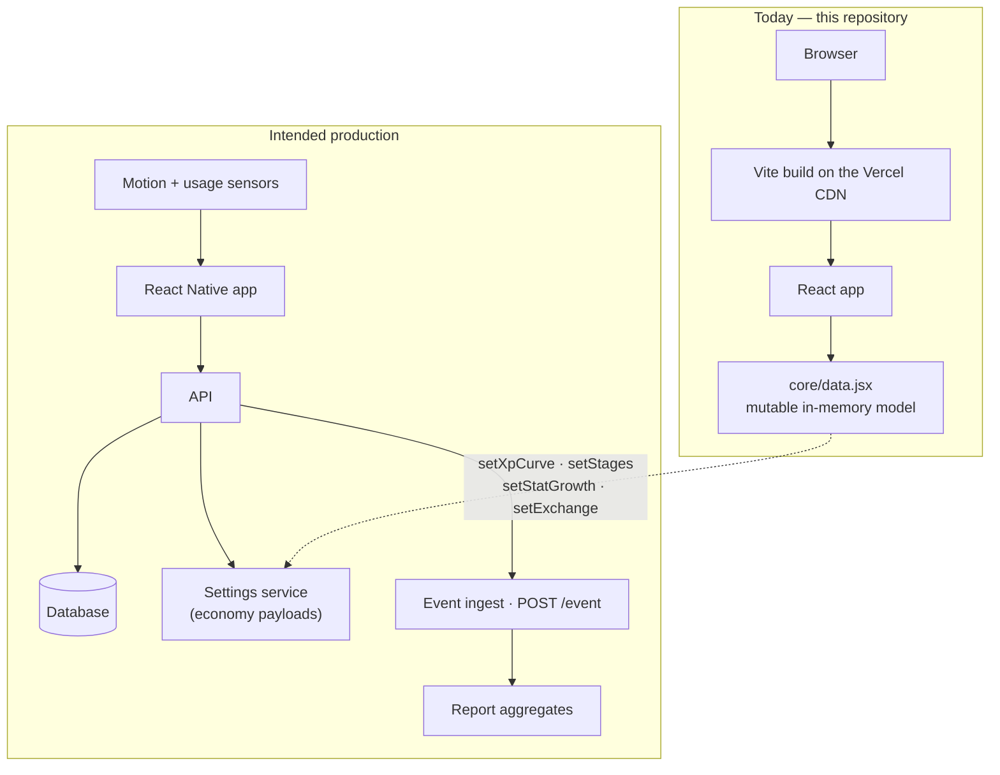

### 23.2 Authentication

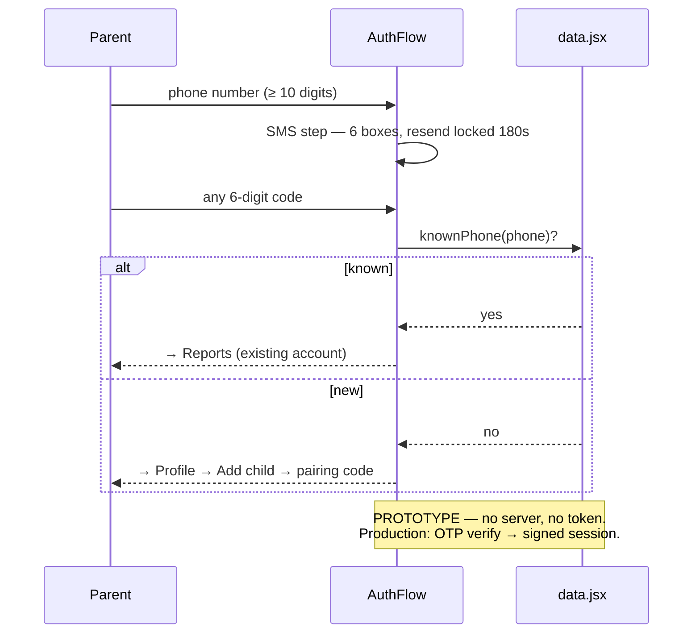

### 23.3 A battle, end to end

```mermaid
sequenceDiagram
    participant C as Child
    participant B as Battle.jsx
    participant D as data.jsx
    C->>B: Find a match
    B->>D: battlePower(buddy)
    D-->>B: 255
    B->>B: win = 255 + 30 ≥ villain.power (165)?
    alt win — first clear
        B->>D: villain.defeated = true; clears++
        B->>D: gainXp(buddy, 60) → may level up and evolve
        B->>D: PLAYER.points += 120
        B->>D: nextVillain() → aim at the newly unlocked foe
    else win — final boss (Nox)
        B->>D: + Epic Egg, 500pt / 200xp
        B->>D: endingUnlocked() → true
    else loss
        B->>D: PLAYER.points += 10
    end
    B->>D: PLAYER.battlesToday++ (cap 5)
    B-->>C: Result screen + the battle math, shown
```

### 23.4 The reward engine

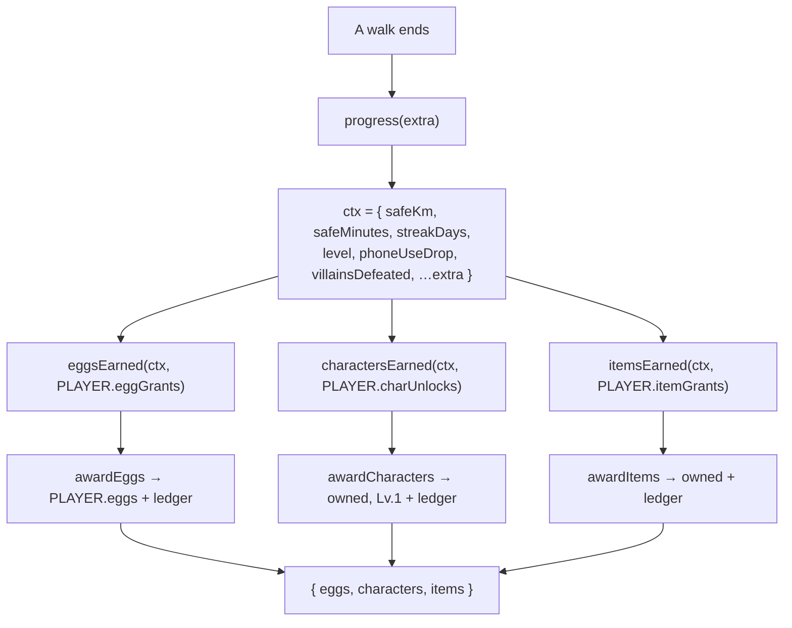

---

## 24. Glossary

### Product & domain

| Term | Meaning |
|---|---|
| **Smombie** | "Smartphone zombie" — someone walking while staring at their phone. The problem JoanX exists to solve |
| **Smart mode** | The in-scope build: motion-only detection, no GPS, overlay warnings (F-02) |
| **Lite mode** | Excluded this revision: a full-screen block instead of an overlay (F-01/F-10). Built but parked |
| **Grace period** | 10 seconds to self-correct before any intervention fires (F-07) |
| **Buzz hold** | 2 seconds after the vibration; stopping here means no warning ever appears (F-08.1) |
| **Tone tier** | The escalating voice of a warning: gentle → firm → urgent (F-08.3) |
| **Immediate / delayed / ignored** | How a risk event ended. Drives both the bonus and the parent report (F-12) |
| **Buddy** | The child's active character |
| **Stage** | Evolution step 1–3 (Hatchling / Growing / Guardian). **Art only — grants no stats** |
| **Rarity** | Common / Rare / Epic. Drives base stats, egg odds, and duplicate EXP |
| **Hidden Epic** | An Epic that does not exist in the UI until unlocked — no slot, no silhouette (F-15.2) |
| **Grant / unlock rule** | A data row saying "when X, award Y". One matcher serves eggs, characters and items |
| **Ledger** | `ruleId → timesPaid`. The guard that stops a grant paying twice |
| **First clear / repeat clear** | Beating a villain the first time (pays more, unlocks story) vs. re-fighting it (A-8.1) |
| **Mid-boss / final boss** | Villain **roles** (Vilord / Nox). Boss status is a role, never a row position |
| **Season** | Content authored ahead and shipped dark (`enabled: false`) until ops flips a flag |
| **Safe-walk bonus** | The `+30` added to a buddy's power in a battle |
| **phoneUseDrop** | Phone use vs. the child's **own** first week — self-referential on purpose |
| **Limited protection** | The state after a permission is denied: reduced capability, explained, never a dead end |

### Technical

| Term | Meaning |
|---|---|
| **Tweaks panel** | The prototype's dev/QA harness — switch layouts, trigger a warning, force demo states |
| **Variant** | An alternative layout of the same screen, selectable at runtime. *Design inventory, not product code* |
| **`ctx`** | The single prop every screen receives: nav, params, tweaks, language, mode |
| **Server-configurable** | A value treated as business policy: a launch default plus a validating setter for a remote payload |
| **Spec ID (`F-xx` / `A-x.x`)** | A requirement from the client's functional spec, cited in the code at the rule implementing it |
| **`screenBgFor()`** | Derives the screen wash from the active buddy/brand colour (hex → HSL → hue rotation), with a neon guard |
| **Neon guard** | The `s > 0.80` branch that pastelises saturated colours instead of lightening them into fluorescent pink |
| **`jx-*`** | The animation utility classes in `joanx.css` |
| **Mascot renderer** | One of 7 art styles behind a single `<Mascot>` dispatcher, chosen by `window.JX_CHAR_STYLE` |
| **Verdict** | The `{ ok, reason, need }` shape returned by `canBuyItem` / `canConvertPoints` |

---

## 25. Appendix

*(The reference appendices A–O follow.)*

---
---

# Part VI — Reference

## Appendix A — Complete data dictionary

Every table in `src/core/data.jsx`, with its real values.

### A.1 Flags & policy

| Constant | Value | Spec |
|---|---|---|
| `FEATURES` | `{ dangerZones: false }` | F-05, F-06 — the whole location family, gated off |
| `BATTLES_PER_DAY` | `5` | A-8 |
| `BATTLE_REWARDS.firstClear` | `{ points: 120, xp: 60 }` | A-8.1 |
| `BATTLE_REWARDS.repeat` | `{ points: 40, xp: 20 }` | A-8.1 |
| `BATTLE_REWARDS.loss` | `{ points: 10, xp: 0 }` | A-8.1 |
| `BATTLE_REWARDS.finalClear` | `{ points: 500, xp: 200, egg: 'epic', ending: true }` | A-8 |

### A.2 `PLAYER` — the child's game state

```js
{ name: 'Mina', age: 11, points: 1240, streak: 5, level: 7, xp: 320,
  safeMinutesToday: 47, safeWalkGoal: 60, activeCharId: 'c2', battlesToday: 0,
  safeKm: 32.4, safeMinutes: 1180,        // A-2.1 — lifetime, never reset
  phoneUseDrop: 0.42,                     // A-4.1 — vs. own first week
  eggs: { common: 1, rare: 0, epic: 1 },
  eggGrants: { 'g-km-10': 1, 'g-km-every': 1 },   // ledgers
  charUnlocks: { 'u-streak-7': 1 },
  itemGrants: {},
  friendCode: 'JNX-MINA-27', likes: 18, houseBg: 'sky', childId: 'k1' }
```
`xpMax`, `maxed`, `stage` are **derived** by `applyXpCurve()` — never authored.

### A.3 `POINTS` (F-13 / F-14 / A-1.1) — server-configurable

| Field | Value |
|---|--:|
| `perSafeMinute` | 10 |
| `minSessionSeconds` | 60 |
| `immediateStopBonus` | 20 |
| `dailyAccidentFreeBonus` | 100 |
| `streak7Days` / `streak7Bonus` | 7 / 300 |
| `streak30Days` / `streak30Reward` | 30 / `'epic-egg'` |

### A.4 `INTERVENTION` (F-07–F-09) — server-configurable
See [§4.1](#41-staged-intervention--the-safety-core) for the full tier and message tables.

### A.5 `XP_CURVE_DEFAULTS` (A-3.1)
```js
{ maxLevel: 10, steps: [100,120,150,180,220,270,330,400,480], growth: 1.2, roundTo: 10 }
```

### A.6 `STAGE_DEFAULTS` (A-3.3)

| stage | minLevel | name | anim | expression |
|--:|--:|---|---|---|
| 1 | 1 | Hatchling | `jx-float` | curious |
| 2 | 4 | Growing | `jx-bounce` | happy |
| 3 | 8 | Guardian | `jx-pulse-soft` | proud |

⚠️ **Landmine:** a few comments in `data.jsx` say "Stage 2 starts at Lv.5". **They are stale.** The
table says **1 / 4 / 8**. Trust the table.

### A.7 `STATS` & `STAT_GROWTH_DEFAULTS` (A-3.3)
`STATS` = `hp` (heart) · `courage` (flame) · `protection` (shield) · `speed` (gauge).
Growth table in [§4.3](#43-character-growth--evolution). **No stage term.**

### A.8 `EXCHANGE_DEFAULTS` (A-1.2)
`{ pointsPerXp: 5, stepXp: 10 }`

### A.9 `RARITIES`

| key | label | badge | `dupXp` | `hiddenUntilUnlocked` |
|---|---|---|--:|---|
| `common` | Common | default | 30 | — |
| `rare` | Rare | primary | 60 | — |
| `epic` | Epic | epic | 120 | **true** |

### A.10 `CHARACTERS` — 15 rows (8 · 5 · 2)

| id | Name | Species | Rarity | Seed |
|---|---|---|---|---|
| `c2` | Mochi | cat | Common | **Starter** — owned, Lv.5, room r1 |
| `c3` | Pip | bird | Common | owned, Lv.2 |
| `c10` | Bloo | cat | Common | owned, Lv.5 |
| `c11` | Cocoa | — | Common | locked |
| `c12` | Sky | — | Common | locked |
| `c13` | Snap | croc | Common | locked (guard 72) |
| `c14` | Pebble | owl | Common | locked |
| `c15` | Biscuit | fox | Common | locked |
| `c1` | **Hammy** | fox | Rare | owned, Lv.7 — the default buddy |
| `c6` | Sunny | owl | Rare | owned, Lv.5 — seeded XP-full to demo evolution |
| `c9` | Toffee | fox | Rare | owned, Lv.7 |
| `c16` | Luna | owl | Rare | locked |
| `c17` | Basil | croc | Rare | locked |
| `c18` | **Ember** | croc | **Epic** | *Hidden.* "Walk safely 30 days in a row" |
| `c19` | **Zephyr** | bird | **Epic** | *Hidden.* "Win a special event mission" |

### A.11 `EGGS` (A-2.1)

| id | Name | Price | minLevel | odds C/R/E |
|---|---|--:|--:|---|
| `common` | Common Egg | 500 | 0 | 8 / 2 / 0 |
| `rare` | Rare Egg | 1500 | 5 | 3 / 6 / 0 |
| `epic` | Epic Egg | `null` | 0 | 0 / 4 / 6 |

### A.12 `SOURCES` — the 9 acquisition routes

| key | Label | Claim |
|---|---|---|
| `mission` | Missions | manual |
| `distance` | Distance & time | auto |
| `streak` | Safe streak | auto |
| `behaviour` | Less phone use | auto |
| `purchase` | Point shop | manual |
| `levelUp` | Level-up reward | auto |
| `event` | Events & seasons | auto |
| `achievement` | Achievements | manual |
| `villain` | Villain battles | auto |

### A.13 `EGG_GRANTS` — 12 rules

| id | Source | Egg | When | Repeatable |
|---|---|---|---|:--:|
| `g-daily` | mission | common | daily set cleared | ✅ |
| `g-weekly` | mission | rare | weekly set cleared | ✅ |
| `g-km-10` | distance | common | `safeKm ≥ 10` | — |
| `g-km-50` | distance | rare | `safeKm ≥ 50` | — |
| `g-min-600` | distance | common | `safeMinutes ≥ 600` | — |
| `g-km-every` | distance | common | every 25 km | ✅ |
| `g-lv-every-5` | levelUp | rare | every 5 levels | ✅ |
| `g-lv-10` | levelUp | epic | at Lv.10 | — |
| `g-streak-30` | event | epic | 30-day streak | ✅ |
| `g-spring-26` | event | epic | spring event — **`enabled: false`** | ✅ |
| `g-ach-zone` | achievement | common | achievement `a4` | — |
| `g-ach-collector` | achievement | rare | achievement `a5` | — |

### A.14 `CHARACTER_UNLOCKS` — 6 rules
See [§4.4](#44-eggs-rarity--acquisition).

### A.15 `ITEM_GRANTS` — 8 rules

| id | Source | Item | When |
|---|---|---|---|
| `i-lv-8` | levelUp | goggles | at Lv.8 |
| `i-ach-reflex` | achievement | poster | `a3` (Quick Reflex) |
| `i-ach-collector` | achievement | shelf | `a5` (Collector) |
| `i-villain-5` | villain | medal | 5 villains defeated |
| `i-villain-10` | villain | trophy | 10 villains defeated |
| `i-winter-wreath` / `-lantern` / `-aurora` | event | wreath / lantern / aurora | winter-2026 — **`enabled: false`** |

### A.16 `ITEMS` = `OUTFITS` (9) + `DECOR` (8) + `HOUSE_BGS` (9)

**Outfits** — `scarf` (0, stage 2) · `cape` (0, stage 3) · `bow` (200) · `glasses` (250) ·
`cap` (280, stage 2) · `crown` (300, stage 3) · `goggles` (320, **Lv.8**) · `medal` (280) ·
`wreath` (360, limited, winter-2026).

**Decor** — `plant` (0) · `lamp` (0) · `rug` (80) · `shelf` (120) · `poster` (90) · `balloon` (60) ·
`trophy` (260) · `lantern` (340, limited).

**House backgrounds** — `sky` / `sunset` / `mint` (0, owned) · `grape` (200) · `candy` (200) ·
`night` (300) · `wood` (180) · `meadow` (180) · `aurora` (400, limited).

**No decoration has a `null` price** (BR-3).

### A.17 `ACHIEVEMENTS` — 6

| id | Name | Goal | Reward | Done |
|---|---|---|--:|:--:|
| `a1` | First Steps | Walk safely for 10 minutes | 50 | ✅ |
| `a2` | 5-Day Streak | Be safe 5 days in a row | 120 | ✅ |
| `a3` | Quick Reflex | Stop within 3 s, 10 times | 80 | ✅ |
| `a4` | Zone Dodger | Avoid 5 danger zones | 150 | 3/5 |
| `a5` | Collector | Own 8 characters | 200 | 6/8 |
| `a6` | Early Walker | Safe morning commute, 7 days | 130 | 4/7 |

### A.18 `ROOMS` — 4

| id | Name | Slots | Unlocked by |
|---|---|--:|---|
| `r1` | Cozy Den | 3 | — |
| `r2` | Sky Loft | 3 | — |
| `r3` | Star Studio | 4 | Collect 8 characters |
| `r4` | Garden | 4 | Reach a 30-day streak |

### A.19 `PERMISSIONS` — 4 (all `required: true`)
`motion` · `usage` · `overlay` (`settings: true` → opens the system sheet) · `notif`.
Full copy in [§5.2](#52-child-pairing--there-is-no-child-login).

### A.20 `APP_CATEGORIES` — 6

| id | Name | Blocked by default | Locked |
|---|---|:--:|:--:|
| `video` | Video | ✅ | — |
| `games` | Games | ✅ | — |
| `social` | Social | ✅ | — |
| `browser` | Web Browser | — | — |
| `camera` | Camera | — | — |
| `phone` | **Phone & Texts** | — | **🔒 never blockable** |

### A.21 `AUTH` (F-33)
`{ smsCodeLength: 6, smsResendSeconds: 180, methods: [phone ✅ primary · google (android) ·
apple (ios) · email ❌ disabled] }` · `KNOWN_PHONES = ['010-1234-5678', '01012345678']`.

### A.22 `VILLAINS` — 10
See [§4.5](#45-villain-battles--the-ending). Roles: `minion` ×8 · `midBoss` (Vilord) ·
`finalBoss` (Nox).

### A.23 Parent-side tables
`CHILDREN` (3: k1 Mina 11 · k2 Leo 8 · k3 Yuna 6) · `CHILD_REPORTS` (keyed by child id) ·
`PARENT_ALERTS` (8, kinds: warning / safe / ignored / device_off / limited / streak / device_on) ·
`PARENT_METRICS` · `REACTIONS_7D` · `RISK_TREND` · `LINK` · `PARENT_SEES` (7 rows, 4 shared / 3 private).

### A.24 Social
`FRIENDS` (3) · `FRIEND_REQUESTS` (1) · `FRIEND_SUGGESTIONS` (3) · `GUEST_STAMPS` (6) ·
`MY_GUESTBOOK` (3).

---

## Appendix B — Function reference (`core/data.jsx`)

The complete public API of the domain module.

### B.1 Level & EXP

| Function | Signature | Returns |
|---|---|---|
| `isMaxLevel` | `(level) → bool` | `level >= XP_CURVE.maxLevel` |
| `xpForLevel` | `(level) → number \| null` | EXP to reach `level+1`; `null` at the cap |
| `xpToCap` | `(c) → number` | Total EXP from the character's current state to the cap |
| `applyXpCurve` | `(holders?) → void` | Re-derives `level`, `maxed`, `xpMax`, `xp`, `stage` |
| `setXpCurve` | `(settings) → XP_CURVE` | Validates + applies remote settings |
| `gainXp` | `(c, amount, player?) → { gained, levels, lost, stageUp }` | **The single XP path** |

### B.2 Stages & stats

| Function | Signature | Returns |
|---|---|---|
| `stageForLevel` | `(level) → 1\|2\|3` | The stage a level earns |
| `stageOf` | `(stage) → row` | Art / anim / expression / lines |
| `stageBand` | `(stage) → { min, max }` | e.g. Stage 2 → `{4, 7}` |
| `nextStageAt` | `(level) → number \| null` | The level the next stage lands at |
| `finalStage` | `() → 3` | |
| `moodForStage` | `(stage) → 'alert'\|'happy'\|'proud'` | |
| `setStages` | `(rows) → STAGES` | Validates + re-sorts + `applyXpCurve()` |
| `statsFor` | `(c) → { hp, courage, protection, speed }` | Derived on read |
| `statMax` | `(key) → number` | Per-stat ceiling for bar scaling |
| `battlePower` | `(c) → number` | `courage + protection + speed + hp/5` |
| `setStatGrowth` | `(settings) → STAT_GROWTH` | **Ignores `stageMult` on purpose** |

### B.3 Economy

| Function | Signature | Returns |
|---|---|---|
| `pointsForXp` | `(xp) → number` | `xp × pointsPerXp` |
| `xpFromPoints` | `(points) → number` | `floor(points / pointsPerXp)` |
| `maxConvertibleXp` | `(c, player) → number` | Bounded by both the wallet and the cap |
| `canConvertPoints` | `(xp, c, player) → verdict` | `no-buddy` · `maxed` · `min` · `cap` · `points` · `ok` |
| `convertPointsToXp` | `(xp, c, player) → verdict & gainXp result` | Debits **only** on `ok` |
| `setExchange` | `(settings) → EXCHANGE` | Rejects `pointsPerXp < 1` |
| `canBuyItem` | `(item, player, stage?) → verdict` | `owned` · `not-for-sale` · `level` · `stage` · `points` · `ok` |
| `buyItem` | `(item, player, stage) → verdict` | Debits + sets `owned` on `ok` |

### B.4 The grant engine

| Function | Signature | Notes |
|---|---|---|
| `progress` | `(extra?, player?) → ctx` | Builds the matching context |
| `isOwed` | `(rule, ctx, claimed) → number` | **A count, not a boolean** |
| `eggsEarned` | `(ctx, claimed?) → [{ grant, egg, qty }]` | |
| `charactersEarned` | `(ctx, claimed?, rnd?) → [{ rule, character }]` | Never returns a duplicate |
| `itemsEarned` | `(ctx, claimed?) → [{ grant, item }]` | Skips already-owned items |
| `awardEggs` / `awardCharacters` / `awardItems` | `(earned, player) → earned` | **The only writers of the ledger** |
| `claimRewards` | `(extra?, player?, rnd?) → { eggs, characters, items }` | All three faucets, one call |

### B.5 Eggs & the roster

| Function | Signature | Notes |
|---|---|---|
| `rollRarity` | `(egg, rnd?) → 'common'\|'rare'\|'epic'\|null` | Weighted by the egg's odds |
| `hatchEgg` | `(egg, rnd?) → character` | Tier first, then unowned-weighted pick |
| `eggById` · `activeEggs` · `eggCount` · `totalEggs` | | |
| `eggSources` / `itemSources` / `grantsForEgg` / `grantsForItem` | | "How do I get this?" derived from the rules |
| `rarityOf` · `charactersOfRarity` · `isRevealed` · `visibleCharacters` | | **F-15.2 gating** |
| `unlockRoutes` / `unlockHints` | `(c) → …` | The dex's "how to get it" line |

### B.6 Villains

| Function | Signature | Notes |
|---|---|---|
| `activeVillains` | `() → [villain]` | Enabled only, sorted by `lv` |
| `villainByLv` | `(lv) → villain \| null` | |
| `villainUnlocked` | `(v) → bool` | Sequential unlock (A-8) |
| `nextVillain` | `() → villain \| null` | The current challenger |
| `villainsDefeated` | `() → number` | **Enabled ladder only** |
| `finalVillain` | `() → villain` | **By role, not by index** |
| `endingUnlocked` | `() → bool` | |
| `roleOf` / `isBoss` | `(v) → …` | |

### B.7 Intervention & misc

| Function | Signature |
|---|---|
| `interventionTier` | `(round) → tier` |
| `interventionMessages` | `(round) → [string]` |
| `logRiskEvent` | `(event) → event` |
| `missionsCleared` | `(scope) → bool` |
| `authMethods` / `devicePlatform` / `knownPhone` | Auth helpers |
| `linkedChild` / `parentSharesSeen` / `parentSharesHidden` | Parent-link helpers |

---

## Appendix C — Component API reference

### `Button`

| Prop | Type | Default | Notes |
|---|---|---|---|
| `variant` | `primary` · `secondary` · `outline` · `danger` · `ghost` · `play` · `gold` | `primary` | |
| `size` | `sm` · `md` · `lg` | `md` | 12 / 14 / 20 px radius |
| `icon` | kebab-case string | — | Auto-sized (18 / 20) and auto-coloured |
| `fullWidth` · `disabled` | bool | `false` | `disabled` → opacity .45, no handler |
| `onClick` | fn | — | Pointer-down scales to .97 (tactile) |

### `Icon`
`{ name (kebab-case), size = 20, color = '#2b2926', stroke = 1.8, fill = 'none', style, className }`
→ maps to lucide's PascalCase component. **Swapping icon libraries touches one file.**

### `Bar` (progress / XP)
`{ value = 0, max = 100, color = THEME.primary, track = THEME.border, height = 10, glow }`

### Others
`Badge { variant }` · `Card { onClick }` · `Input { label, value, onChange, type, icon, error, trailing, accent }` ·
`Toggle { on, onChange }` · `SectionHead { title, action, onAction }` · `StatusBar { dark }`.

### `child/shared.jsx`
`ScreenHeader { title, onBack, right }` · `StageUpMoment` · `HatchCelebration` ·
`Confetti { n }` · `RarityPill` · `DexProgress { have, total, label, icon, accent }` ·
`PointsChip` · `StatCard`.

---

## Appendix D — Screen reference

### Child app

| Screen | Lines | Purpose | Key state | Spec |
|---|--:|---|---|---|
| `Onboarding` | 601 | Pair + permissions + first egg | `step` 0-4 · `grants` · `code` · `eggPhase` | F-26, F-33 |
| `ChildHome` | 113 | Buddy hero, XP, daily goal | — | F-13 |
| `HomeVariants` | 479 | 6 alternative home layouts | — | — |
| `HomeVariantsSimple` | 733 | 7 more (the default `simple-focus`) | `tasks`, `cheer` | — |
| `SafetyStatus` | 109 | Protection status, walk detection | — | F-03, F-25 |
| `WarningOverlay` | 545 | **The safety core** | `phase` · `round` · `confirming` | F-07–F-12 |
| `LiteBlock` | 40 | Full-screen block (parked) | `secs` | F-10 🚫 |
| `Collection` | 156 | Owned buddies + rooms | — | F-18 |
| `CollectionVariants` | 545 | 20 layouts | `tab` | — |
| `CharacterDetail` | 121 | Buddy detail | `color` | F-16, F-17 |
| `CharacterVariants` | 581 | 5 detail layouts + the item shop | `tab` · `bought` · `worn` | A-5.1 |
| `CharacterDex` | 58 | Encyclopedia | — | A-4 |
| `CharacterDexVariants` | 262 | 11 dex layouts | — | — |
| `DexHeaders` | 312 | 13 completion-header variants | — | — |
| `VillainDex` | 284 | Villain encyclopedia (road + list) | `sel` | A-9 |
| `Battle` | 306 | PvE battle | `phase` · `targetLv` · `wasEnding` | F-19, A-8 |
| `BattleVariants` | 2,877 | ~38 battle layouts | — | — |
| `Shop` | 430 | Eggs · point→EXP · items | `hatch` · `xpAmt` · `stageUp` | A-1.2, A-2 |
| `EggHatch` | 118 | Shared egg motif + shake-to-hatch | — | A-2.2 |
| `Rewards` | 133 | Streak + achievements | `claimed` · `pop` | F-14 |
| `MyHouse` | 134 | Public profile / house | `bg` · `likes` | A-6 |
| `DecorateRoom` | 136 | Room decoration | `placed` · `styleId` | A-7 |
| `Friends` | 767 | Friend list (35 layouts) | — | F-32 |
| `AddFriends` | 569 | Add by code (25 layouts) | `code` · `tab` | F-32 |
| `FriendHouse` | 110 | Visit a friend | `liked` · `picked` | A-10 |
| `Guestbook` | 74 | Stamp-only guestbook | `likes` | A-10.1 |
| `Notifications` | 71 | Static feed | — | — |
| `Profile` | 148 | Settings + "what my parent sees" | `seeOpen` | A-9 |
| `HelpSupport` | 88 | Accordion | `open` | — |
| `AboutJoanX` | 63 | Legal / version | `open` | — |

### Parent app

| Screen | Purpose | Spec |
|---|---|---|
| `ParentOnboarding` | Splash → intro → `AuthFlow` | F-33 |
| `HowItWorks` | Full-screen scroll-story + plans | — |
| `ParentAddChild` | Add-child wizard + pairing | F-33 |
| `ParentReports` | **The dashboard** | F-20 |
| `ParentAIReport` | Narrative summary | F-31 |
| `ParentChildren` | Children + devices | — |
| `ParentActivity` | Alert feed | F-12 |
| `ParentSettings` | Per-child rules | F-22 |
| `ParentSchedule` | Time rules (parked) | F-21 🚫 |
| `ParentAccount` | Global settings | — |
| `ParentDetail` | Sub-page registry (10 pages) | — |

---

## Appendix E — Traceability matrix

*Spec ID → the code that implements it → how it is verified.* Full list in
[`SPEC-CHECKLIST.md`](SPEC-CHECKLIST.md); the highest-risk rows:

| Spec | Rule | Code | Verified by |
|---|---|---|---|
| F-08.1 | Warning only after a 2 s hold | `INTERVENTION.buzzHoldSeconds` | Manual (Tweaks → trigger a warning) |
| F-08.4 | Anti-flicker | `safeConfirmSeconds` | Manual |
| F-12 | Response classification | `logRiskEvent()` | Manual |
| A-3.1 | EXP curve | `XP_CURVE` · `setXpCurve()` | **Scripted** — the table and a retune were asserted |
| A-3.3 | Stages grant no stats | `STAT_GROWTH` (no stage term) | Code review |
| A-8 | Sequential unlock | `villainUnlocked()` | **Scripted** — the ladder was climbed programmatically |
| A-8 | The ending is role-keyed | `finalVillain()` | **Scripted** — an 11th villain was appended and the finale stayed with Nox |
| A-8.1 | Repeat < first clear | `BATTLE_REWARDS` | **Driven in-app** — first clear, repeat and final clear all exercised |
| F-15.2 | Hidden Epics | `visibleCharacters()` | Code review |
| A-5.1 | Every decoration buyable | No `null` price in `DECOR` / `HOUSE_BGS` | Code review |

---

## Appendix F — Architecture Decision Records (ADRs)

### ADR-001 — No backend in the prototype
**Status:** Accepted · **Context:** The deliverable is a client-reviewable, spec-complete prototype.
**Decision:** Ship no server; model every server value as a mock in `data.jsx`, and build the *seam*
(four validating setters) that a backend will plug into.
**Consequences:** ✅ Fastest path to a complete product story; the settings contract is designed and
tested. ❌ No persistence; the economy is client-mutable (unacceptable in production).

### ADR-002 — No router
**Status:** Accepted · **Decision:** Navigation is a `screen` string + a hand-rolled stack.
**Consequences:** ✅ Zero dependency; deep links still work via query params. ❌ No URL per screen; no
browser back button.

### ADR-003 — Mutable module state instead of a store
**Status:** Accepted (prototype) · **Superseded in production by:** server state.
**Decision:** `PLAYER` / `CHARACTERS` / `VILLAINS` are module-level objects screens mutate directly.
**Consequences:** ✅ Zero boilerplate; the data module is unambiguously the source of truth. ❌ Two
screens can disagree until the next render; a reload wipes everything. → [RISK-1](#appendix-g--risk-register).

### ADR-004 — The economy is data, not code
**Status:** Accepted · **Decision:** Every balance value is a settings object with a launch default and
a validating setter with per-field fallback.
**Consequences:** ✅ Retuning needs no app release; a bad payload degrades gracefully. ❌ More
validation code to maintain.

### ADR-005 — Inline styles over a CSS framework
**Status:** Accepted · **Decision:** Style objects driven by `THEME`, plus `jx-*` animation classes.
**Consequences:** ✅ No build step, no class-name indirection, tokens are JS values. ❌ No style reuse
via cascade; repeated style objects.

### ADR-006 — No TypeScript
**Status:** Accepted (prototype) · **Revisit:** immediately, in the production rebuild.
**Consequences:** ✅ Fast iteration. ❌ No compile-time safety on the grant-rule / verdict / settings
shapes — precisely where types pay for themselves.

### ADR-007 — Villain boss status is a role, not a row position
**Status:** Accepted · **Context:** `boss = last index` silently promotes any appended villain.
**Decision:** `role: 'minion' | 'midBoss' | 'finalBoss'`; `finalVillain()` matches the role.
**Consequences:** ✅ Seasons can append villains safely. ❌ One extra field per row.

### ADR-008 — One item table, three views
**Status:** Accepted · **Decision:** `ITEMS = [...OUTFITS, ...DECOR, ...HOUSE_BGS]`, sharing row
references. **Consequences:** ✅ A new acquisition route lights up every item type at once. ❌ The
shape is less obvious to a newcomer.

### ADR-009 — Guaranteed unlocks alongside the gacha
**Status:** Accepted · **Decision:** `CHARACTER_UNLOCKS` grants characters for real behaviour.
**Consequences:** ✅ The gacha is ethically defensible for children. ❌ Lower monetisation pressure.

### ADR-010 — Stamps, not free text
**Status:** Accepted · **Decision:** Six fixed `GUEST_STAMPS`; no text input exists.
**Consequences:** ✅ No moderation surface, no grooming vector. ❌ Less expressive.

---

## Appendix G — Risk register

| ID | Risk | Severity | Likelihood | Mitigation |
|---|---|---|---|---|
| **RISK-1** | **Client-authoritative economy** — a client mutation could grant infinite points | 🔴 Critical | Certain, once shipped | Move the hatch roll, battle outcome and all point mutations server-side before any public release |
| **RISK-2** | **No tests** — a rule change can silently break the economy | 🔴 High | High | Start with `data.jsx` unit tests ([Appendix H](#appendix-h--qa-test-matrix)) |
| **RISK-3** | **The warning overlay is inaccessible** — a screen-reader user is never told a warning appeared, in a **safety** feature | 🔴 High | Certain | `aria-live="assertive"` + a role on the overlay; an axe pass on every screen |
| **RISK-4** | **No persistence** — a reload wipes a child's progress | 🟠 Medium | Certain (prototype only) | Resolved by the backend |
| **RISK-5** | **Broken asset path** — the `toy` mascot style points at a directory that does not exist | 🟡 Low | Certain if selected | Ship the assets or remove the style |
| **RISK-6** | **Bundle size** — > 500 kB, mostly unchosen layout variants | 🟠 Medium | Certain | Prune the galleries once directions are signed off |
| **RISK-7** | **Stale comments** — `data.jsx` describes stage thresholds as 5/10; the table says 1/4/8 | 🟡 Low | — | Fix the comments; the table is right |
| **RISK-8** | **Spec-doc drift** — the client's spec markdown still lists the pre-revision EXP table and villain roster | 🟠 Medium | Certain | Re-issue the spec, or annotate it |
| **RISK-9** | **Pairing-code brute force** — 6 digits = 10⁶ | 🟠 Medium | Medium | Short expiry + attempt lockout, server-side |
| **RISK-10** | **No error boundary** — one exception blanks the app | 🟡 Low | Medium | Add a boundary per role |

---

## Appendix H — QA test matrix

### Unit — `core/data.jsx` (🔴 P0, and the cheapest tests in the repo)

| # | Case | Expected |
|---|---|---|
| U-01 | `xpForLevel(1)` | `100` |
| U-02 | `xpForLevel(9)` | `480` |
| U-03 | `xpForLevel(10)` | `null` (at the cap) |
| U-04 | `xpForLevel(11)` with `maxLevel: 12` | `steps[9] × 1.2`, rounded up to 10 |
| U-05 | `gainXp` with an amount that spans 3 levels | `levels: 3`, overflow carried, `lost: 0` |
| U-06 | `gainXp` past the cap | `lost > 0`, `xp === xpMax`, `maxed: true` |
| U-07 | `gainXp` crossing Lv.8 | `stageUp: 3` |
| U-08 | `isOwed` for a paid one-shot rule | `0` — never re-awards |
| U-09 | `isOwed` for `g-km-every` at 80 km, nothing paid | `3` |
| U-10 | `isOwed` for `g-km-every` at 80 km, 1 paid | `2` |
| U-11 | `claimRewards()` twice with no new progress | Second call returns three empty arrays |
| U-12 | `rollRarity` over 10,000 rolls of a Common Egg | ≈ 80% common, 20% rare, **0% epic** |
| U-13 | `hatchEgg` — unowned weighting | An unowned character is ~3× likelier than an owned one |
| U-14 | `canBuyItem` — every verdict | `owned` · `not-for-sale` · `level` · `stage` · `points` · `ok` |
| U-15 | `canConvertPoints` near the cap | Returns `cap` with the exact `need` |
| U-16 | `convertPointsToXp` on a failed verdict | **Points are not debited** |
| U-17 | `setXpCurve({steps:[100,'x',-5], maxLevel:0})` | Restores every launch default |
| U-18 | `setStatGrowth({ stageMult: 2 })` | **Ignored** — stats unchanged |
| U-19 | `setExchange({ pointsPerXp: 0 })` | Rejected → default `5` |
| U-20 | `villainUnlocked` on the 5th villain with 3 beaten | `false` |
| U-21 | `endingUnlocked()` after appending an enabled 11th villain | Still keyed to **Nox** |
| U-22 | `visibleCharacters()` with an unowned Epic | The Epic is **absent** from the array |
| U-23 | `statsFor(null)` | An all-zero map, no throw |
| U-24 | `battlePower` monotonic in level | Strictly increasing |
| U-25 | `applyXpCurve()` on a Lv.99 seed | Clamped to `maxLevel` |

### Component (🔴 P0)

| # | Case | Expected |
|---|---|---|
| C-01 | Stop inside the buzz hold | **No warning ever renders**; outcome `immediate` |
| C-02 | Ignore through 3 rounds | Tier reaches `urgent`; outcome `ignored` |
| C-03 | Safe reading that flickers | The overlay does **not** come down before `safeConfirmSeconds` |
| C-04 | Message rotation | No back-to-back repeat within a tier |

### E2E (🟠 P1)
Pair (wrong code → right code) → deny one permission → limited protection → hatch → trigger a warning
→ stop → check points → buy an egg → hatch a duplicate → verify EXP → battle → first clear → repeat
clear → exhaust the daily cap.

### Accessibility (🔴 P0)
axe-core on every screen · keyboard-only traversal of both apps · **the warning overlay announced to a
screen reader**.

---

## Appendix I — New-engineer onboarding

### Day 1

1. `npm install && npm run dev`.
2. Open `/?view=docs` — the visual version of this document, with charts.
3. Open `/?view=checklist` — see what's built and what's excluded.
4. Open the **Tweaks** panel (gear, top right). Click **▶ Trigger a warning**. Watch the whole
   intervention play out. That's the product.
5. **Read `src/core/data.jsx` end to end.** All 1,528 lines. Nothing else in the repo comes close in
   importance — it is the product, expressed as data and rules.

### Week 1

| Day | Task |
|---|---|
| 2 | Read `shell/App.jsx`, then `child/Battle.jsx` — the clearest example of a screen consuming the model |
| 3 | Read `child/WarningOverlay.jsx` — the most stateful screen, and the safety feature |
| 4 | Read `core/primitives.jsx` + the **Design system** tab |
| 5 | Ship something small: add a `data.jsx` unit test, or fix [RISK-7](#appendix-g--risk-register) (the stale stage comments) |

### The five things that will trip you up

1. **The data module is the source of truth, not React.** Screens mutate it directly.
2. **Stage is derived from level.** Never set it. (`applyXpCurve` will overwrite you.)
3. **`isOwed` returns a count, not a boolean.**
4. **The `toy` mascot style is broken** — its assets don't exist. Use `comic`.
5. **A few comments in `data.jsx` are stale** (stage thresholds). Trust the tables.

---

## Appendix J — Coding standards & contribution guide

| Rule | Rationale |
|---|---|
| **Every business rule goes in `core/data.jsx`.** A screen may *read* and *render* a rule; it may never invent one | This is what keeps the model auditable |
| **Cite the spec ID in a comment at the rule** (`// A-3.1 — …`) | It is how the Spec checklist stays honest |
| **Write the *why*, not the *what*, in comments** | The code says what it does. The comment must say why it isn't the obvious thing |
| **Server-configurable values need a setter with per-field fallback** | A bad payload must degrade, never break |
| **Derived state is never authored** (`xpMax`, `maxed`, `stage`) | Two sources of truth is one too many |
| **New reward type? Add a table, not a system** | The matcher/ledger already generalises |
| **No new dependency without a reason** | Three runtime deps is a feature |
| **Match the surrounding style** | Inline styles + `THEME`; no Tailwind creep |

---

## Appendix K — Proposed analytics & event taxonomy

None exists today. The natural taxonomy, derived from the model:

| Event | Properties | Answers |
|---|---|---|
| `risk_event` | `outcome`, `rounds`, `tier`, `time_to_stop_ms` | **The core safety metric** |
| `walk_session_end` | `minutes`, `km`, `points_awarded`, `interrupted` | Is the child walking more safely? |
| `permission_result` | `permission`, `granted` | Where does onboarding leak? |
| `pairing_result` | `attempts`, `succeeded` | |
| `egg_hatched` | `egg_id`, `rarity`, `character_id`, `was_duplicate` | Is the gacha feeling fair? |
| `points_converted` | `xp`, `points`, `buddy_level` | Is the exchange rate right? |
| `battle_resolved` | `villain_id`, `won`, `first_clear`, `power_delta` | **Is the difficulty curve right?** |
| `level_up` / `stage_up` | `level`, `stage`, `days_since_install` | The pacing question ([§2.2](#22-the-economics-of-the-loop--the-single-most-useful-number-in-this-document)) |
| `ending_unlocked` | `days_since_install` | Retention ceiling |
| `parent_report_viewed` | `child_id`, `days_since_last` | Is the parent engaged (i.e. will they renew)? |

**Privacy constraint:** no event may carry location, message content, or an app name — only *category*.

---

## Appendix L — Privacy & compliance

**Not implemented — this is the requirements list a production build must satisfy.**

| Area | Requirement | Current posture |
|---|---|---|
| **COPPA / GDPR-K** | Verifiable parental consent before any child data collection | The parent creates the account and pairs the child — the *shape* is right, the verification is not built |
| **Data minimisation** | Collect only what the safety feature needs | ✅ Already the design: no location, no messages, no photos |
| **Transparency to the child** | The child should know what is shared | ✅ `Profile.jsx` shows `PARENT_SEES` |
| **Retention** | Delete raw risk events after N days; keep aggregates | ⚠️ `ParentDetail.jsx` renders a retention UI — the logic does not exist |
| **Export & delete** | On request | ⚠️ The screen exists; no implementation |
| **Third-party sharing** | None | ✅ No SDKs, no analytics, no ad tech |
| **App-usage data** | Category only, never app names or content | ✅ `APP_CATEGORIES` is categories |

---

## Appendix M — Proposed performance budget

None exists. A sensible starting budget for the production app:

| Metric | Budget | Today |
|---|---|---|
| Initial JS (gzipped) | ≤ 180 kB | **> 500 kB warned by Vite** |
| Largest Contentful Paint | ≤ 2.0 s (4G) | Not measured |
| Interaction to Next Paint | ≤ 200 ms | Not measured |
| Warning-overlay render | **≤ 100 ms from the risk event** | Not measured — **this is a safety-critical path** |
| Mascot render | ≤ 16 ms | Inline SVG; likely fine |

**First actions:** prune the variant galleries · route-level code splitting · lazy-load the doc pages
(they are ~2,500 lines that a child never sees).

---

## Appendix N — Release runbook

| Step | Command / action |
|---|---|
| 1 | `git checkout -b feat/<name>` — never commit to `main` directly |
| 2 | `npm run build` — must pass with no errors |
| 3 | Drive the change in the real app (`npm run dev`) — the Tweaks panel reaches every state |
| 4 | Update [`SPEC-CHECKLIST.md`](SPEC-CHECKLIST.md) **and** `src/docs/SpecChecklist.jsx` together if a spec row changed |
| 5 | Update `PROJECT_DOCUMENTATION.md` + `src/docs/ProjectDocs.jsx` if a rule or number changed |
| 6 | Push → Vercel builds a preview automatically |
| 7 | Merge to `main` → production |

**Rollback:** revert the commit; Vercel redeploys. There is no database, so there is nothing to
migrate back.

---

## Appendix O — File inventory

| File | Lines | Role |
|---|--:|---|
| `src/child/BattleVariants.jsx` | 2,877 | Battle layout gallery (~38) |
| `src/core/data.jsx` | **1,528** | **The model + every rule** |
| `src/docs/DesignSystem.jsx` | 1,096 | Design-system doc page |
| `src/core/characters.jsx` | 919 | 7 mascot renderers |
| `src/docs/ProjectDocs.jsx` | 913 | This document, in-app |
| `src/core/i18n.jsx` | 872 | en/ko dictionary (1,201 keys) |
| `src/child/Friends.jsx` | 767 | 35 friends layouts |
| `src/child/HomeVariantsSimple.jsx` | 733 | 7 home layouts |
| `src/child/Onboarding.jsx` | 601 | Pairing + permissions + first egg |
| `src/child/CharacterVariants.jsx` | 581 | 5 detail layouts + the item shop |
| `src/child/AddFriends.jsx` | 569 | 25 add-friend layouts |
| `src/child/WarningOverlay.jsx` | 545 | **The safety core** |
| `src/child/CollectionVariants.jsx` | 545 | 20 collection layouts |
| `src/child/HomeVariants.jsx` | 479 | 6 home layouts |
| `src/docs/SpecChecklist.jsx` | 467 | Coverage audit page |
| `src/child/Shop.jsx` | 430 | Eggs · exchange · items |
| `src/shell/App.jsx` | 384 | The harness |
| `src/child/DexHeaders.jsx` | 312 | 13 header variants |
| `src/child/Battle.jsx` | 306 | PvE battle |
| `src/child/VillainDex.jsx` | 284 | Villain encyclopedia |
| `src/core/primitives.jsx` | 262 | THEME + UI kit |
| `src/core/auth.jsx` | 218 | Phone → SMS → profile |
| `src/core/nav.jsx` | 70 | TabBar |
| `src/styles/color-system.css` | 878 | Raw ramps |
| `src/styles/joanx.css` | 234 | Fonts, backdrop, motion |
| `src/styles/tripme-tokens.css` | 141 | Semantic aliases |

**Total: ~20,500 lines of JSX across `src/`.**

---

<div align="center">

*End of document. For the visual version with charts, open the app and select **Documentation**
(or `/?view=docs`).*

</div>
